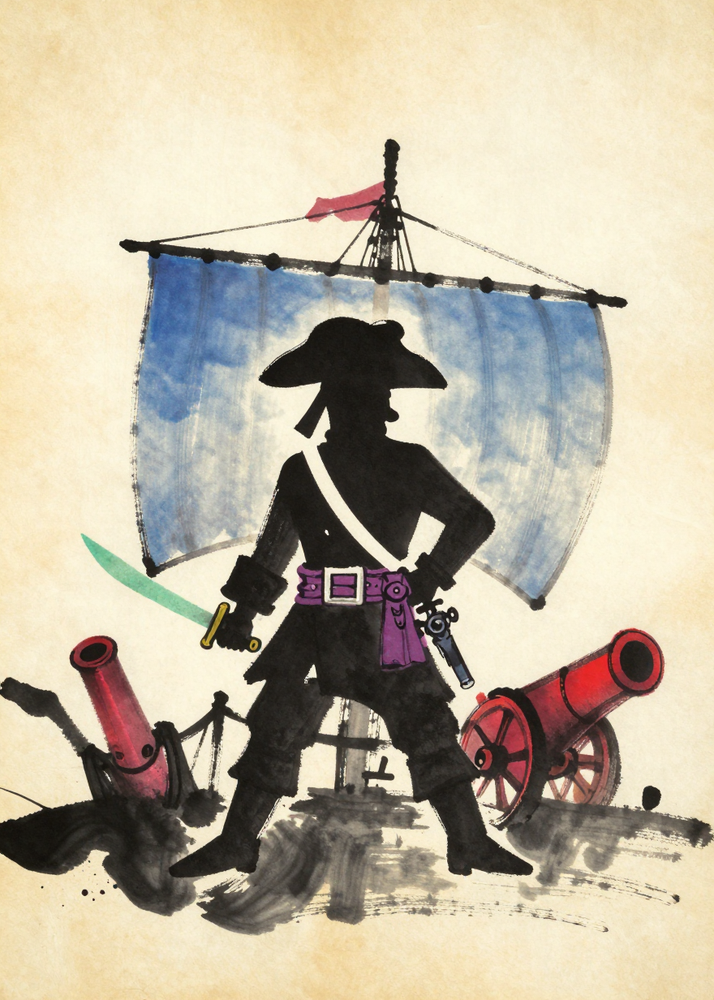
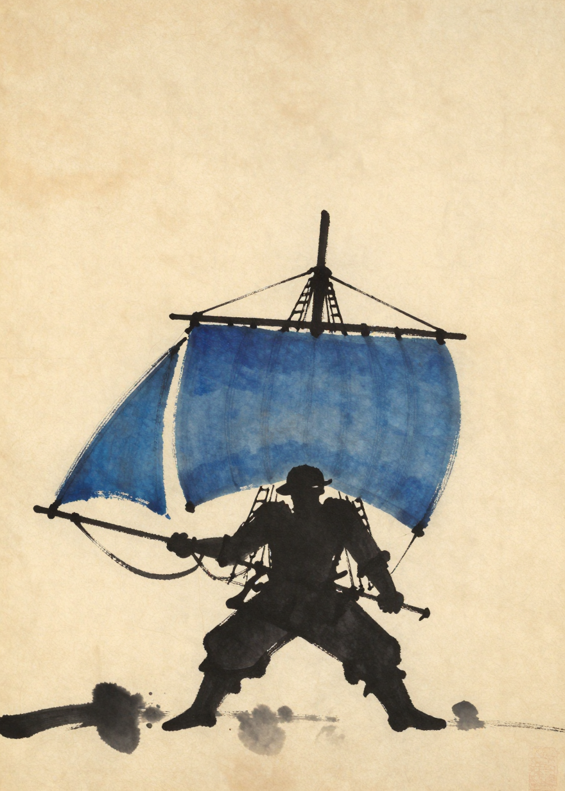
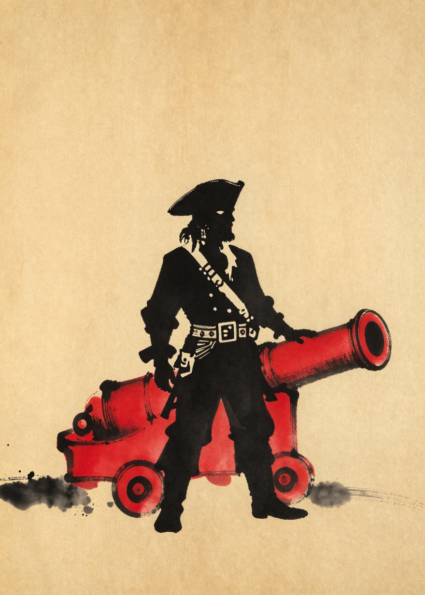
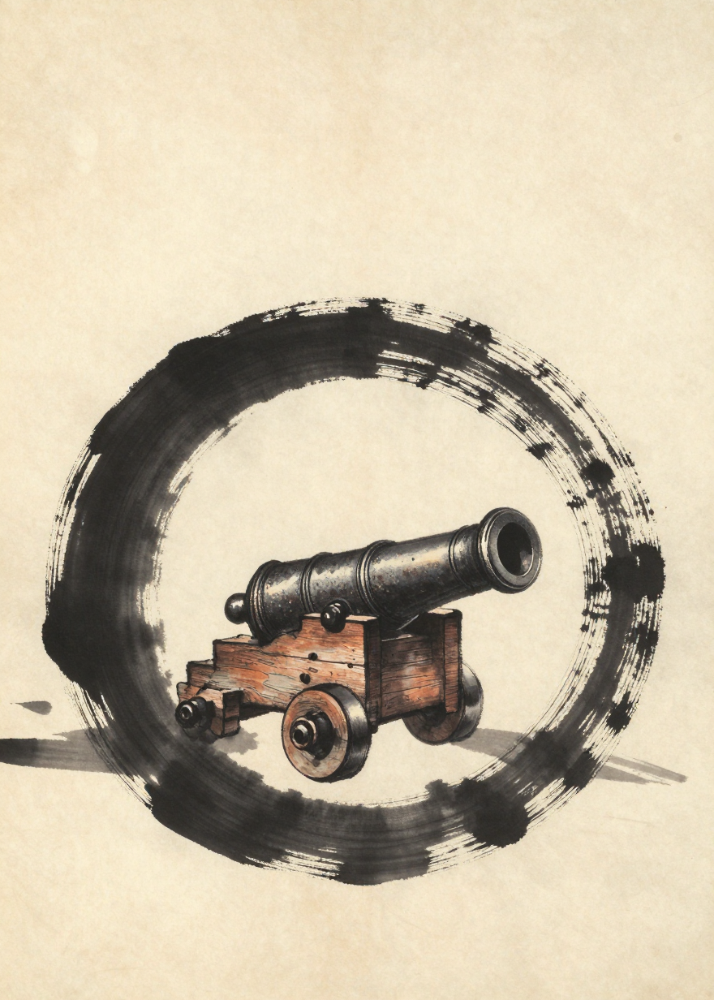
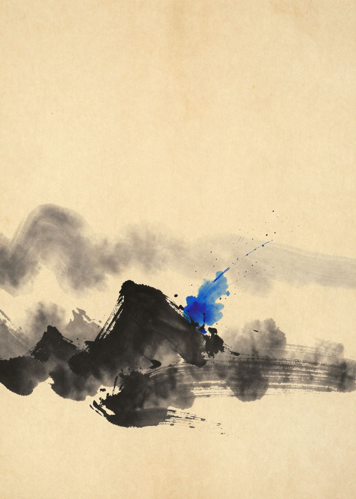
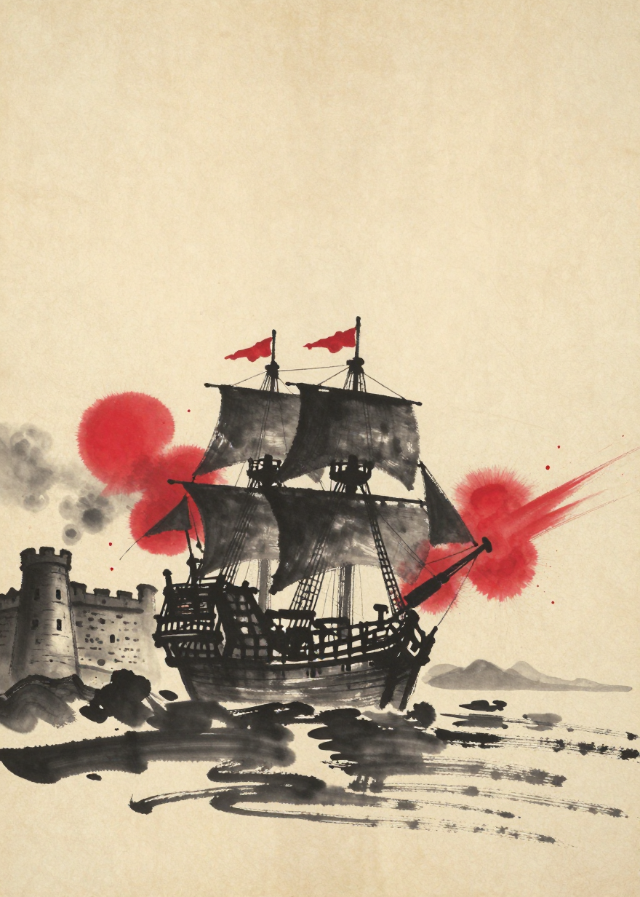
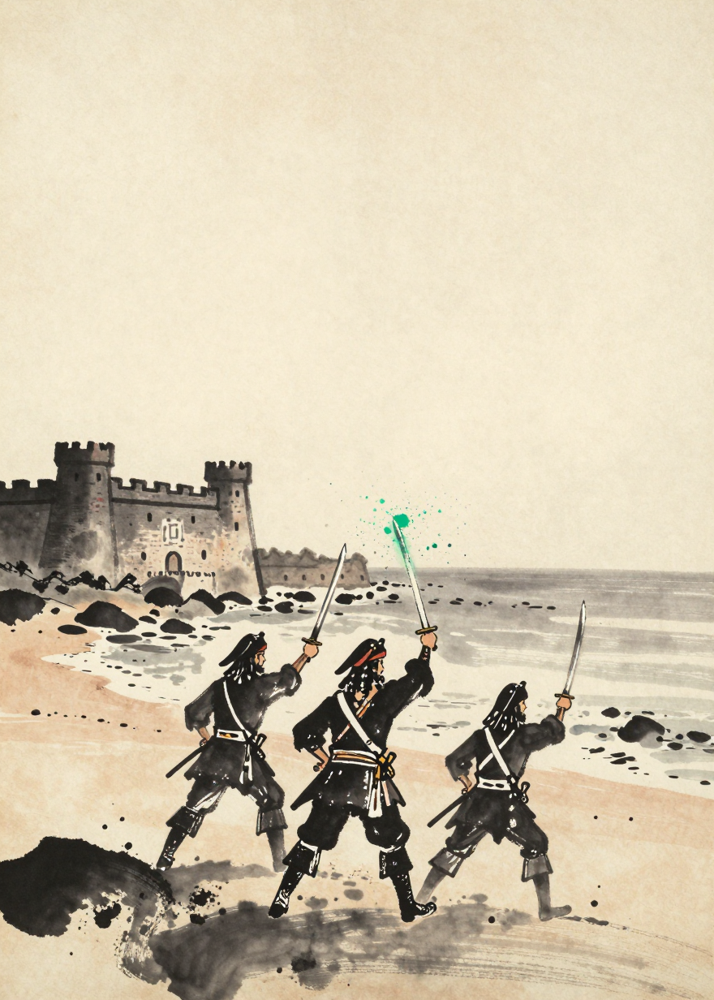
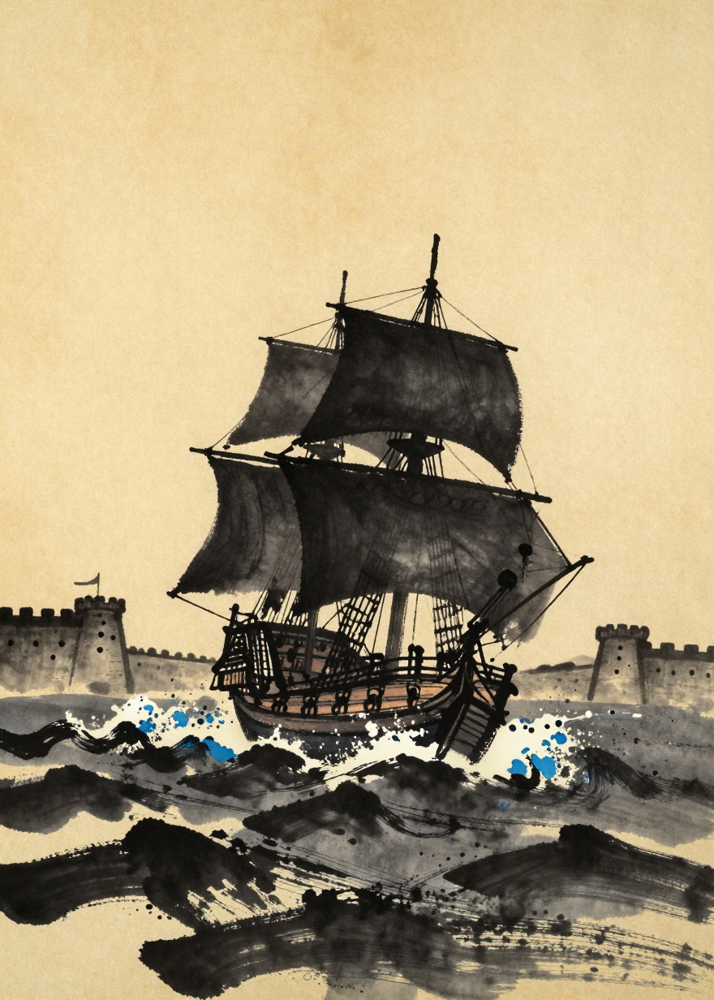
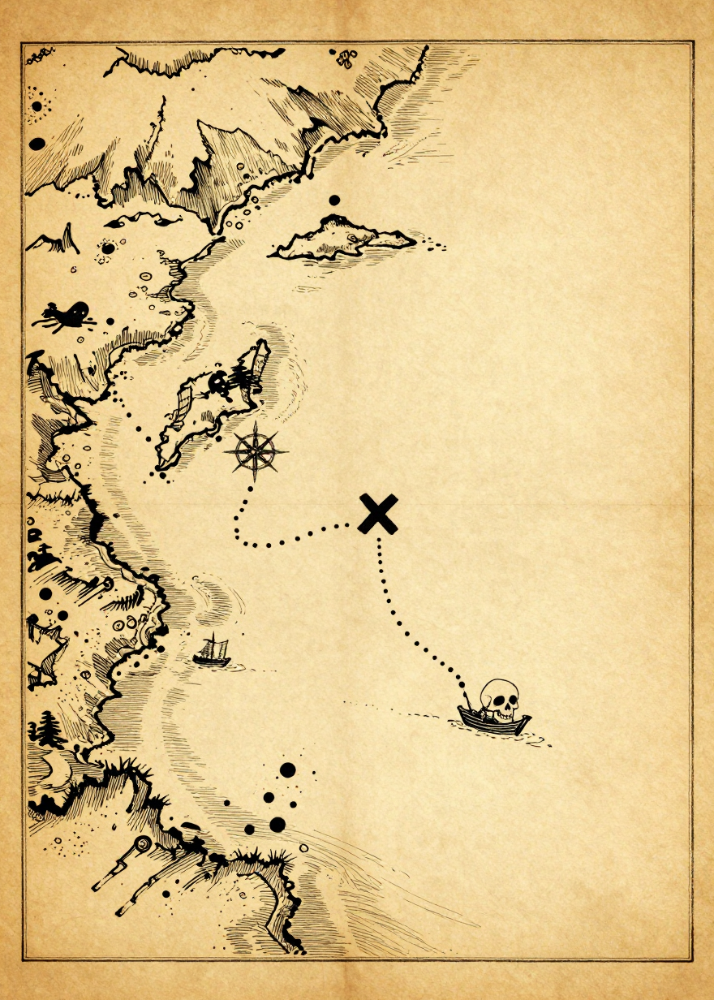
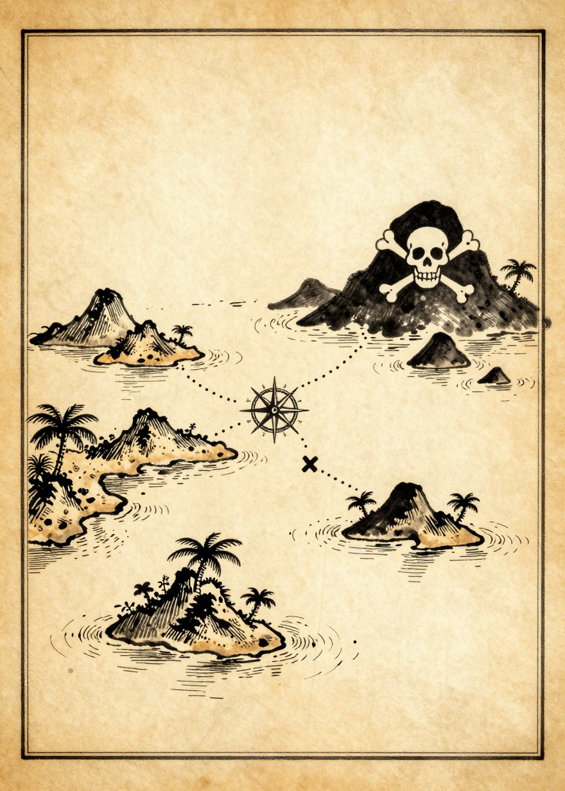

# ART-10 — gate review (11 retries/probes, doctrine v1.2.0)

Batch of 2026-07-15, kernel v16, Z-Image-Turbo. Applies Jules's ART-09 gate
rulings ([previous gallery](REVIEW.md)).

**Pre-screen verdicts:**

| # | Card | Pre-screen |
|---|------|-----------|
| 1 | recruitment_captain (1050) | ✅ both cannons red, all four colors present (tiny red pennant remains) |
| 2 | recruitment_sailmaster (1051) | ✅ proportions fixed |
| 3 | recruitment_gunner (1052) | ✅ massive cannon, solemn stance |
| 4 | talisman_canon_counter_boarding (1014) | ✅ iron/bronze cannon, ensō |
| 5 | curse_foggy_island (1020) | ✅ (indigo splash a bit blobby — reviewer call) |
| 6 | curse_broken_hourglass (1022) | ⚠️ sand rendered natural tan (beyond the jade-only accent); jade splash present |
| 7 | raid_canons (1027 v2) | ✅ multiple bold vermillion bursts (note: mast flags took red too) |
| 8 | raid_officers (1053) | ✅ three officers, sea in ink wash, jade splash — big improvement |
| 9 | raid_sails (1054) | ✅ black sea with indigo touches in the wave crests — as doctrine intends |
| 10 | map_treasure_01 (1048 v2) | ✅ dense detail, compass rose, sea monster, skull present |
| 11 | map_treasure_02 (1055) | ❌ border line AGAIN despite seed bump — model wants framed sheets for archipelago maps |

For #11 two remedies: (a) rephrase so land masses are cut by the canvas edges
("islands sliced by the edges of the canvas, the strait continuing past the top
and bottom edges"), or (b) accept and crop ~2–3% offline then upscale back
(the line sits at the very edge).

---

### 1. recruitment_captain — seed 1050

### 2. recruitment_sailmaster — seed 1051

### 3. recruitment_gunner — seed 1052 (gravitas rework)

### 4. talisman_canon_counter_boarding — seed 1014 (contre-abordage probe)

### 5. curse_foggy_island — seed 1020

### 6. curse_broken_hourglass — seed 1022 ⚠️

### 7. raid_canons — seed 1027 v2 (bolder red)

### 8. raid_officers — seed 1053 (three figures, ink sea)

### 9. raid_sails — seed 1054 (ink sea, indigo crests)

### 10. map_treasure_01 — seed 1048 v2 (enriched)

### 11. map_treasure_02 — seed 1055 ❌ (border persists)

