# ART-11 — final sweep (12 rows) — 9 auto-approved, 3 pending Jules's ruling

Kernel v17, Z-Image-Turbo, 2026-07-15. Protocol: approve everything cleanly
on-doctrine ([ART-09](REVIEW.md) · [ART-10](REVIEW-ART10.md)).

| # | Card | Verdict |
|---|------|---------|
| 1 | raid_sails (1057) | ✅ approved — dominant indigo sails, ink sea |
| 2 | map_treasure_01 (1058) | ✅ approved — land/features in all four corners |
| 3 | map_treasure_02 (1059) | ✅ approved — skull island / volcano / reef / watchtower, no border |
| 4 | curse_ghost_ship (1060) | ✅ approved — Bateau Fantôme, plum glow in mist |
| 5 | talisman_golden_monkey (1013) | ✅ approved — gold idol in ensō |
| 6 | recruitment_quartermaster (1004) | ✅ approved — crossed jade swords |
| 7 | recruitment_deckhands (1005) | ✅ approved — twin plum pistols |
| 8 | talisman_officer_counter_boarding (1015) | ✅ approved — steel/brass sword in ensō |
| 9 | talisman_sailor_counter_boarding (1017) | ✅ approved — walnut/steel pistol in ensō |
| 10 | raid_officers (1056) | ⚠️ PENDING — much closer, but a small red fortress flag + faint blue-grey sea tint break "background + black + value color only" |
| 11 | recruitment_navigator (1007) | ⚠️ PENDING — whole ship with tiny figure; recruit grammar wants a figure-dominant silhouette |
| 12 | talisman_sail_counter_boarding (1016) | ⚠️ PENDING — whole boat with dark sail instead of a lone cream-canvas sail |

### 1. raid_sails
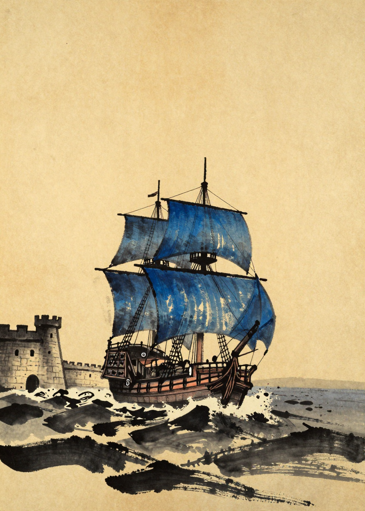

### 2. map_treasure_01
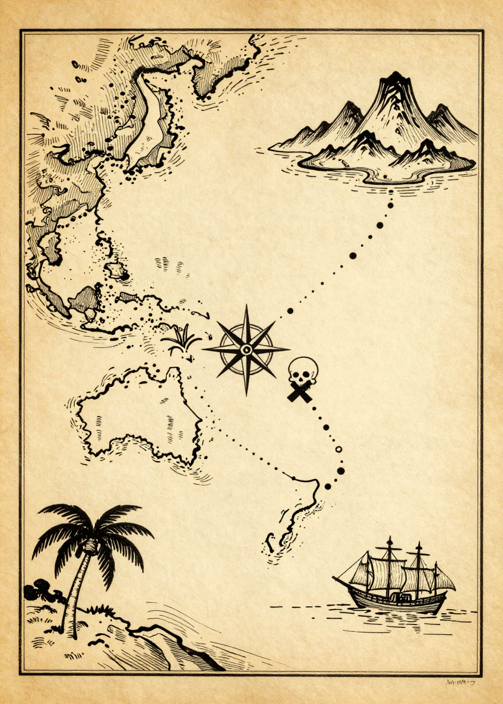

### 3. map_treasure_02
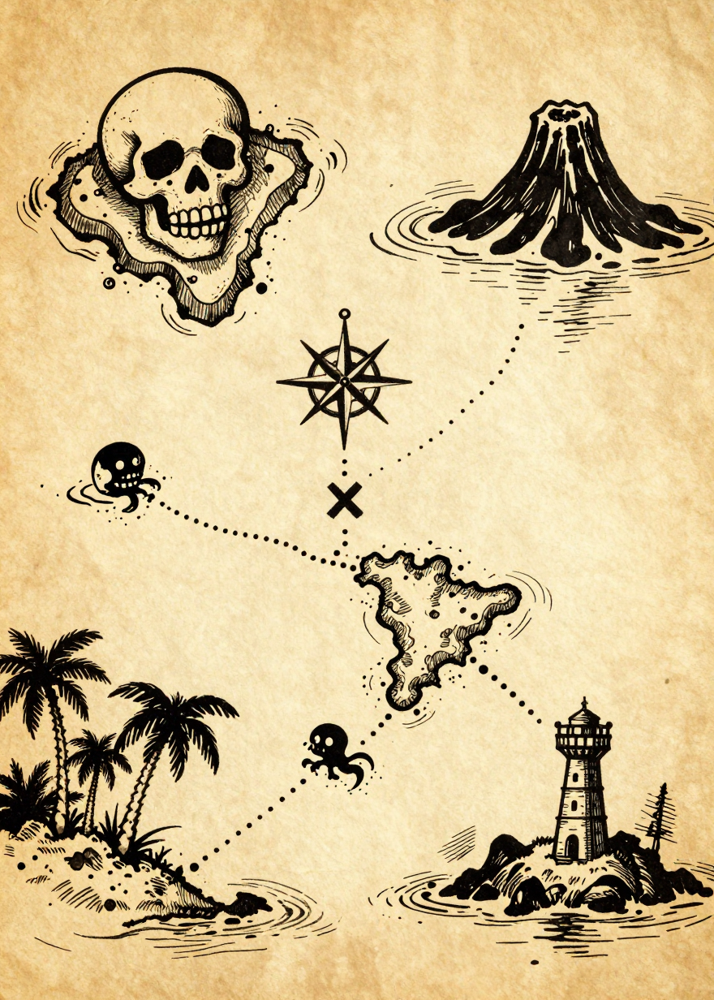

### 4. curse_ghost_ship
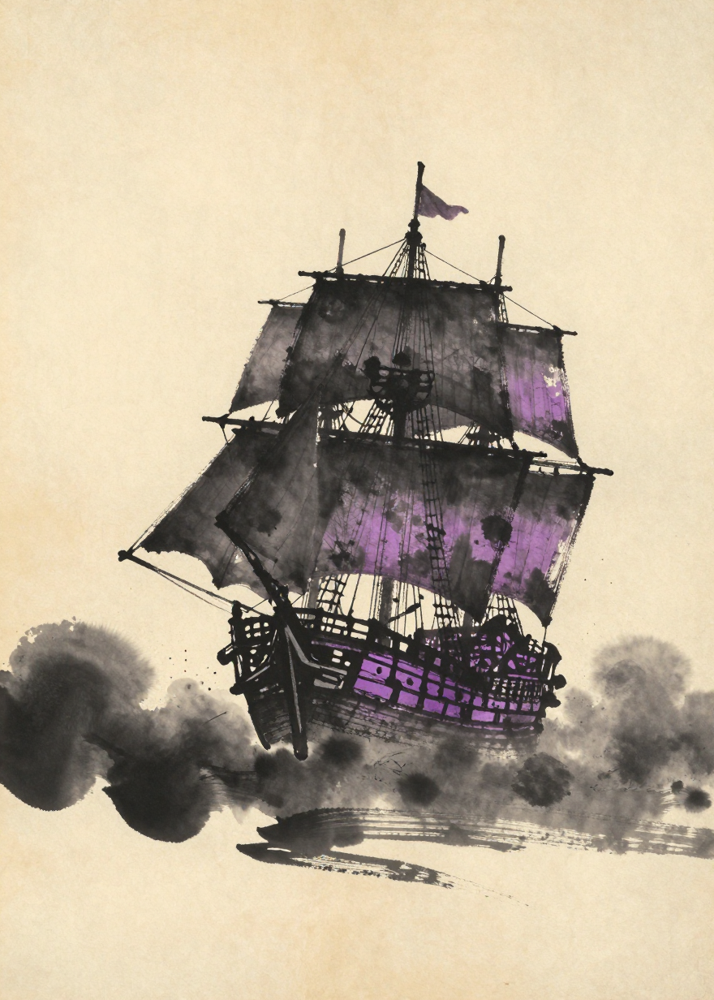

### 5. talisman_golden_monkey
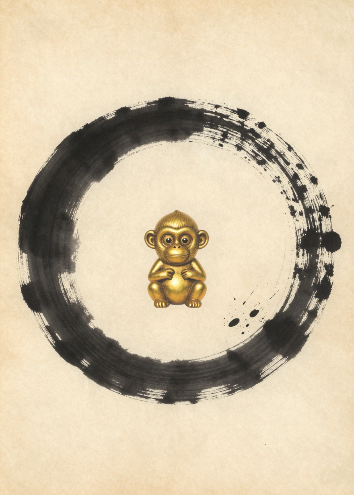

### 6. recruitment_quartermaster
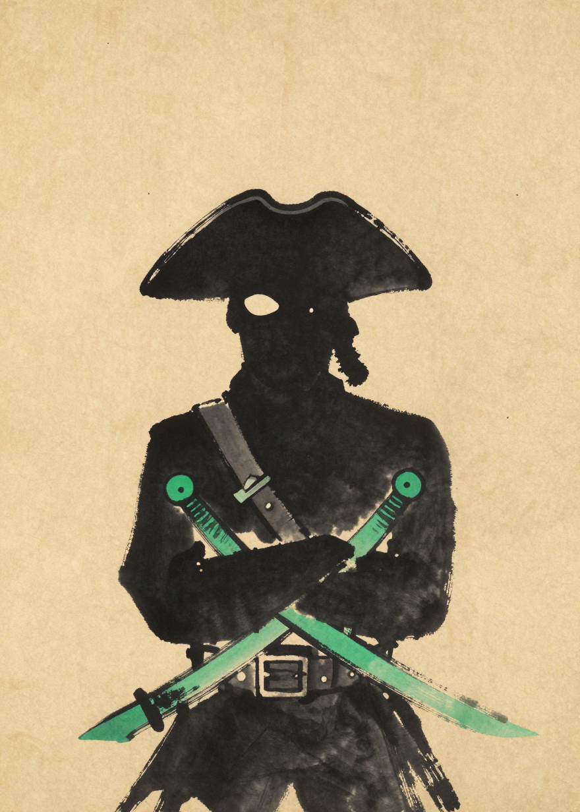

### 7. recruitment_deckhands
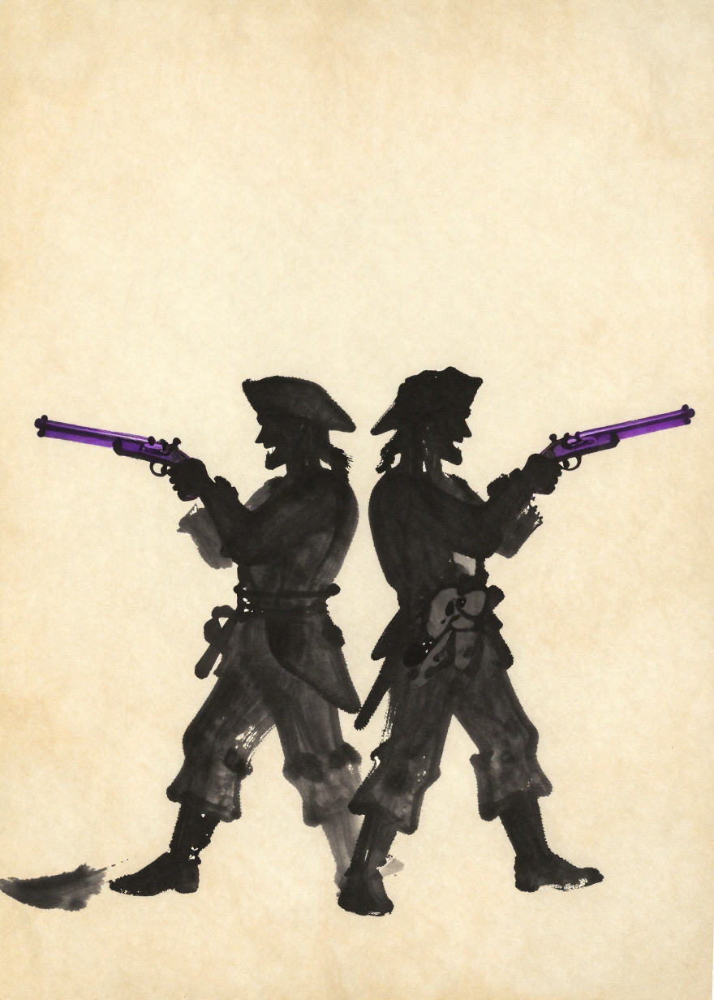

### 8. talisman_officer_counter_boarding
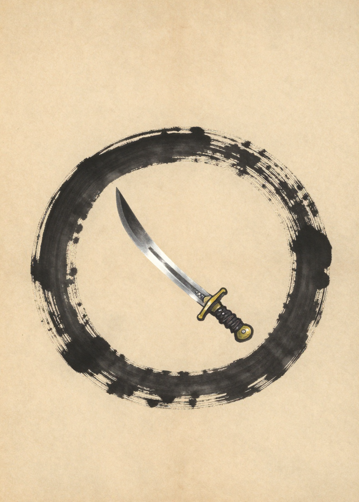

### 9. talisman_sailor_counter_boarding
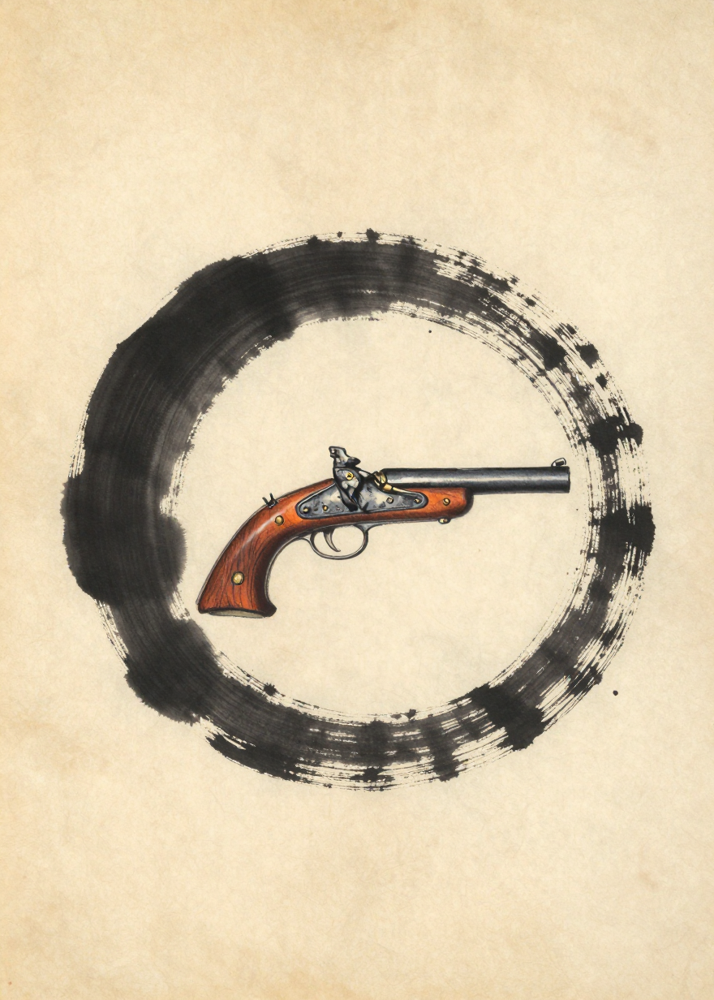

### 10. raid_officers ⚠️
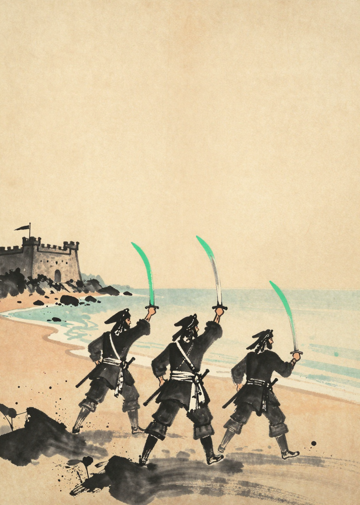

### 11. recruitment_navigator ⚠️
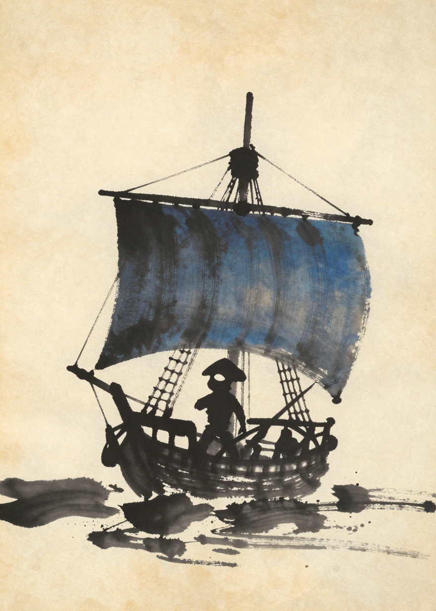

### 12. talisman_sail_counter_boarding ⚠️
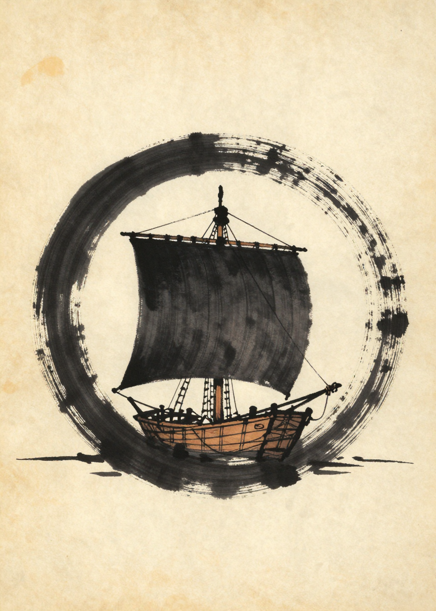
