# ART-13 — rework round (13 images) — 9 keep / 3 rework / 1 borderline

Batches of 2026-07-16 (kernels v20/v21/v22, one dispatch per batch a/b/c),
Z-Image-Turbo, seeds 1334–1346 per `img13/generation_log.csv`. Doctrine:
style bible **v1.3.1** + Jules's ART-12 gate notes. Verdicts are Claude's
pre-screen — the gate ruling is Jules's.
Prior galleries: [ART-12](REVIEW-ART12.md) · [ART-11](REVIEW-ART11.md) · [ART-10](REVIEW-ART10.md) · [ART-09](REVIEW.md).

| # | Card | Verdict |
|---|------|---------|
| A1 | recruitment_captain (1334) | ❌ rework — all four objects now present and large, but the vermillion landed on the boat hull instead of the cannon barrel (stayed black) and the jade went to the shoulder strap instead of the saber blade |
| A2 | recruitment_deckhands (1335) | ✅ keep — solid black silhouette, one readable eye, two plum pistols, zero stray color; exactly the requested fix |
| B1 | raid_sails (1336) | ✅ keep — bold correct indigo dominating the sails, black hull, ink sea, same fortress scene |
| B2 | raid_officers (1337) | ✅ keep — generous jade bursts around the ship as asked (tiny gold trim on the bow figurehead, crop-irrelevant) |
| B3 | raid_sailors (1338) | ✅ keep — big plum splashes around the ship only, black sea (faint plum on the far headland) |
| B4 | curse_foggy_island (1339) | ✅ keep — towering fog-wrapped island finally dominates; small junks at its base give scale, indigo drifts subtle |
| B5 | map_treasure_01 (1340) | ❌ rework — corners illustrated but the middle is an empty void, and it drew a border again |
| B6 | map_treasure_02 (1341) | ⚠️ borderline — all four corners illustrated, central volcano-X, route, twin monsters… but a thin border line persists; a ~3% crop removes it if Jules prefers not to reroll |
| C1 | talisman_spyglass (1344) | ✅ keep — a single tapering telescope tube at last, brass wash, complete ensō; binocular curse broken on the final allowed attempt |
| C2 | talisman_trapped_chest (1345) | ✅ keep — jagged trap teeth unmistakable in the open lid, chest fully inside a complete ensō |
| C3 | talisman_golden_monkey (1346) | ✅ keep — clearly a cast-gold idol statue on a base now, complete ensō |
| C4 | back_events (1342) | ❌ rework — regressed into a literal playing card (white face, corner "8♠" indices, red/black/purple pips); my "no spades no clubs" phrasing planted the concept — next roll must never mention playing cards at all |
| C5 | back_treasures (1343) | ❌ rework — same failure: white card face, four spade pips, stray blue inner border; X-wreath center and anchor corners were right |

**Round score: 9 clean keeps + 1 crop-fixable of 13.** Combined with the
ART-12 gate: **30 of 33 cards have an approved master** (captain, events
back, treasures back remain; plus map choice). Rework queue: batch a = 1
(captain), batch c = 2 (backs) — one more short run once Jules rules.

---

## Batch A — crew

### A1. recruitment_captain (1334) ❌
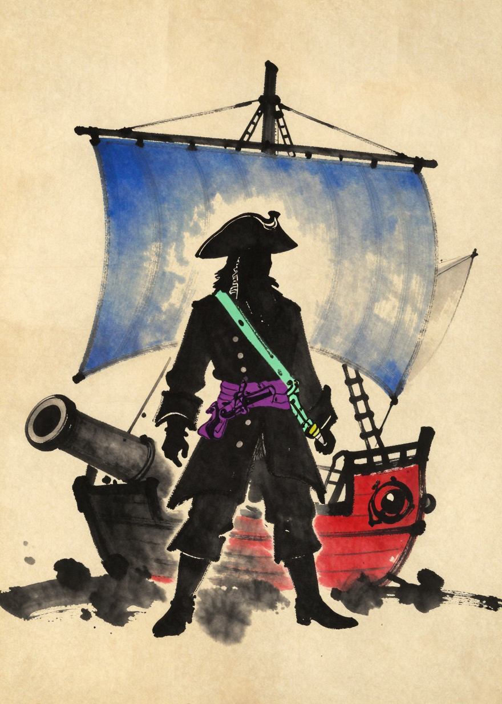

### A2. recruitment_deckhands (1335) ✅
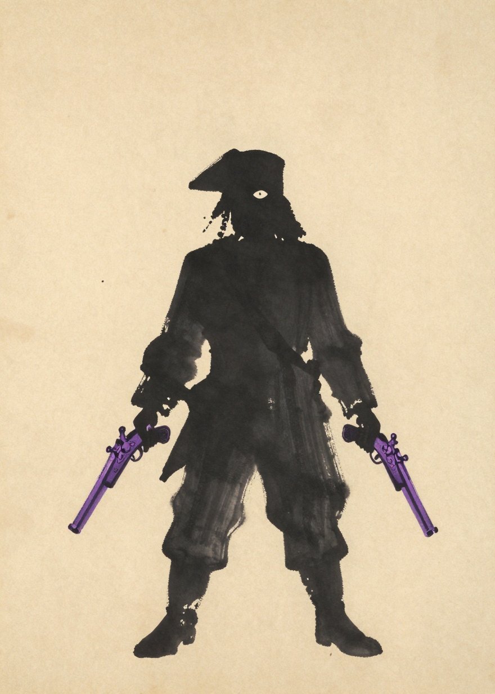

## Batch B — raids, curse & maps

### B1. raid_sails (1336) ✅
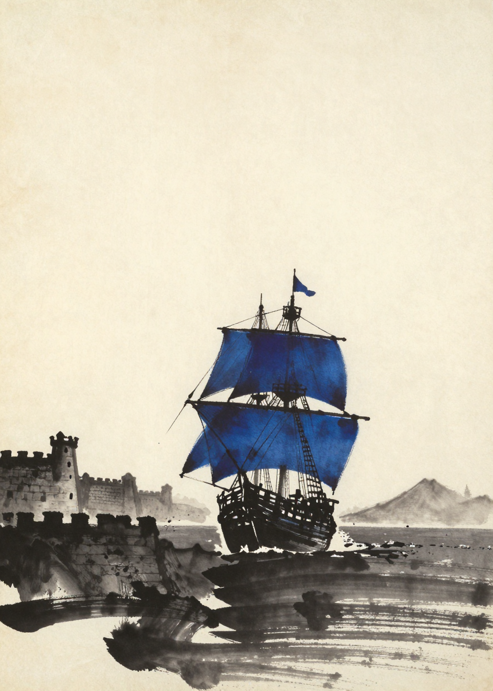

### B2. raid_officers (1337) ✅
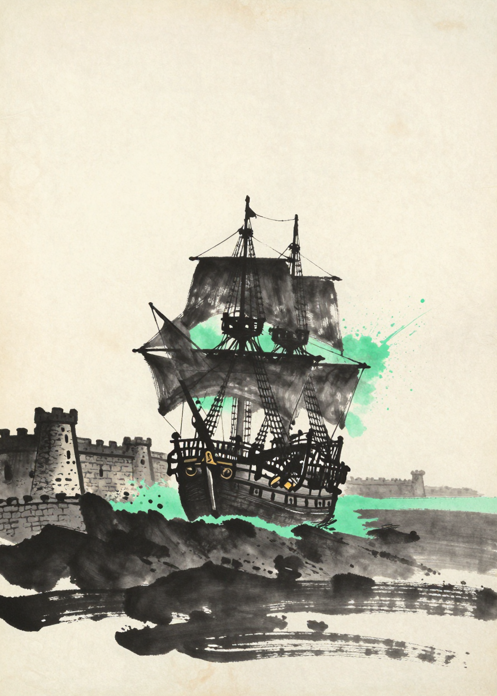

### B3. raid_sailors (1338) ✅
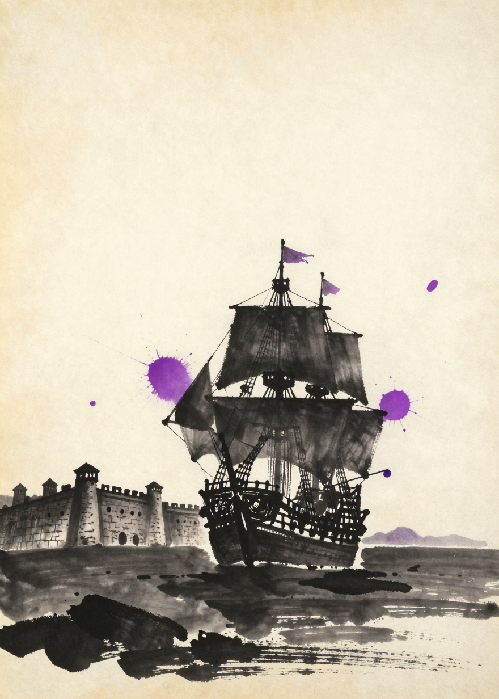

### B4. curse_foggy_island (1339) ✅
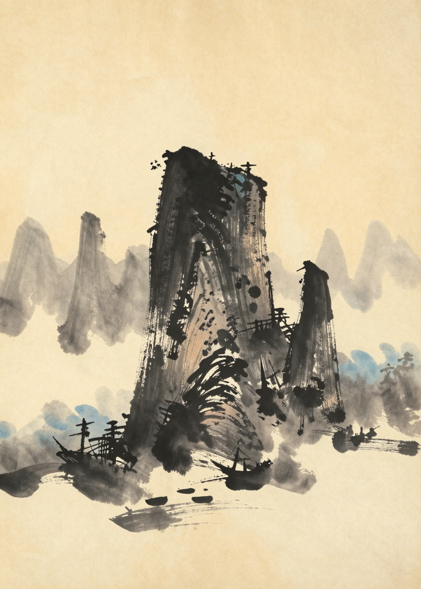

### B5. map_treasure_01 (1340) ❌
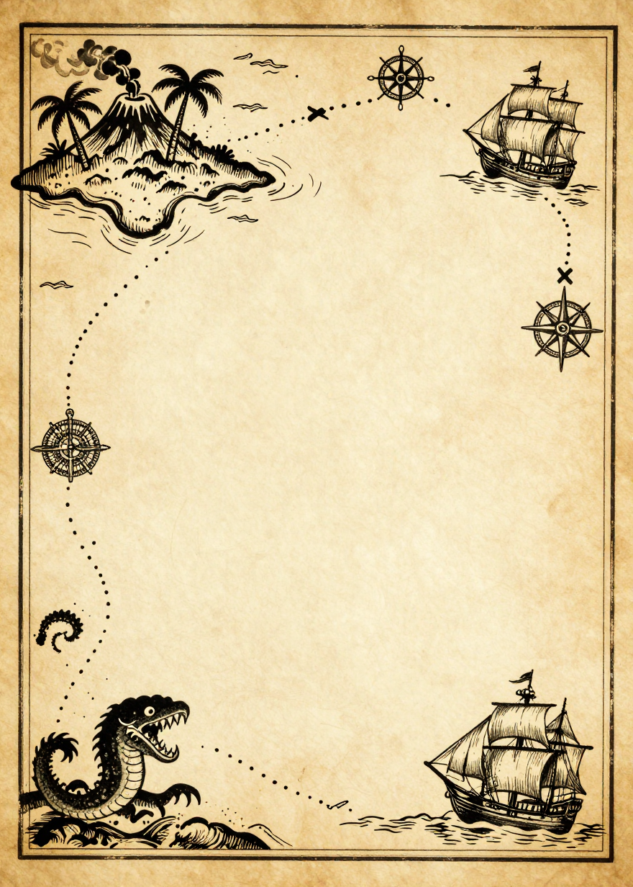

### B6. map_treasure_02 (1341) ⚠️
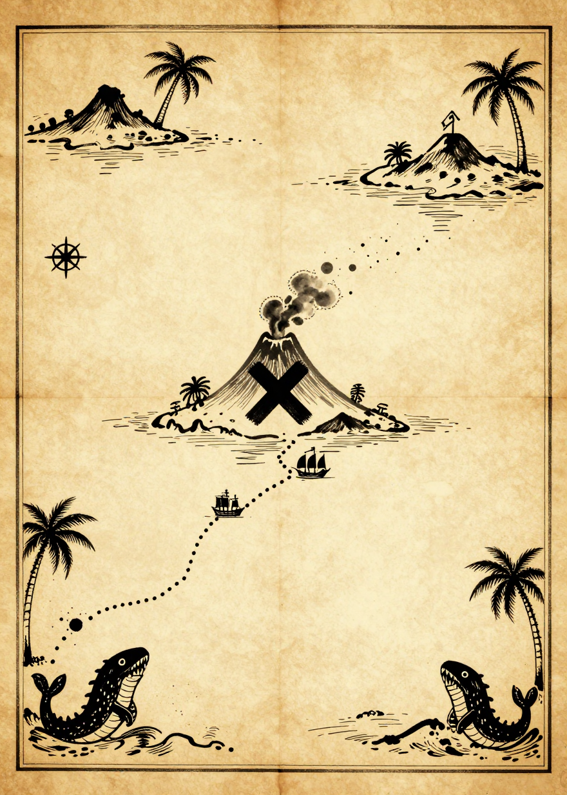

## Batch C — talismans & backs

### C1. talisman_spyglass (1344) ✅
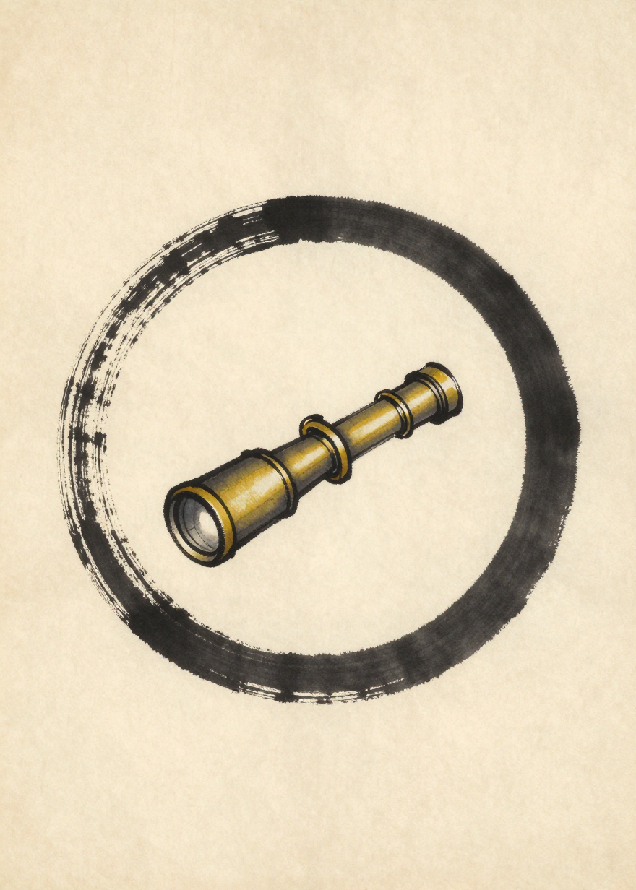

### C2. talisman_trapped_chest (1345) ✅
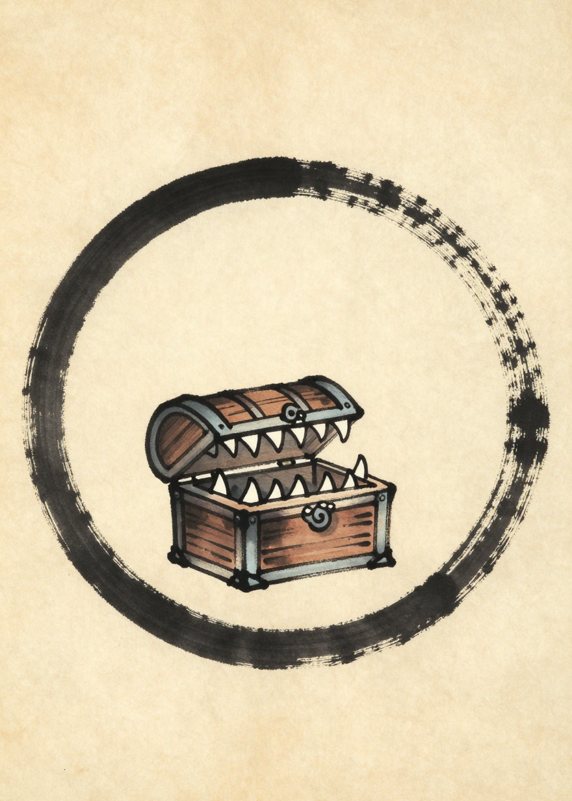

### C3. talisman_golden_monkey (1346) ✅
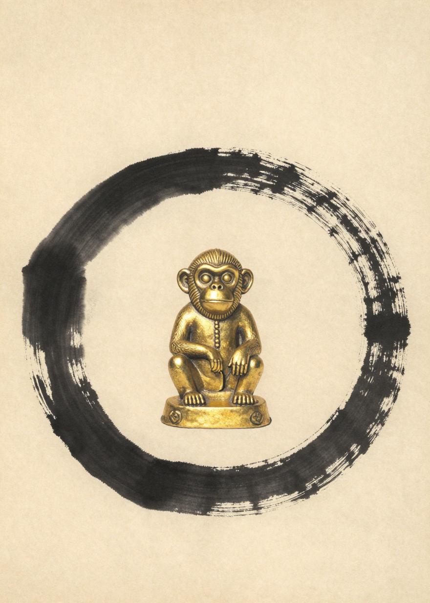

### C4. back_events (1342) ❌
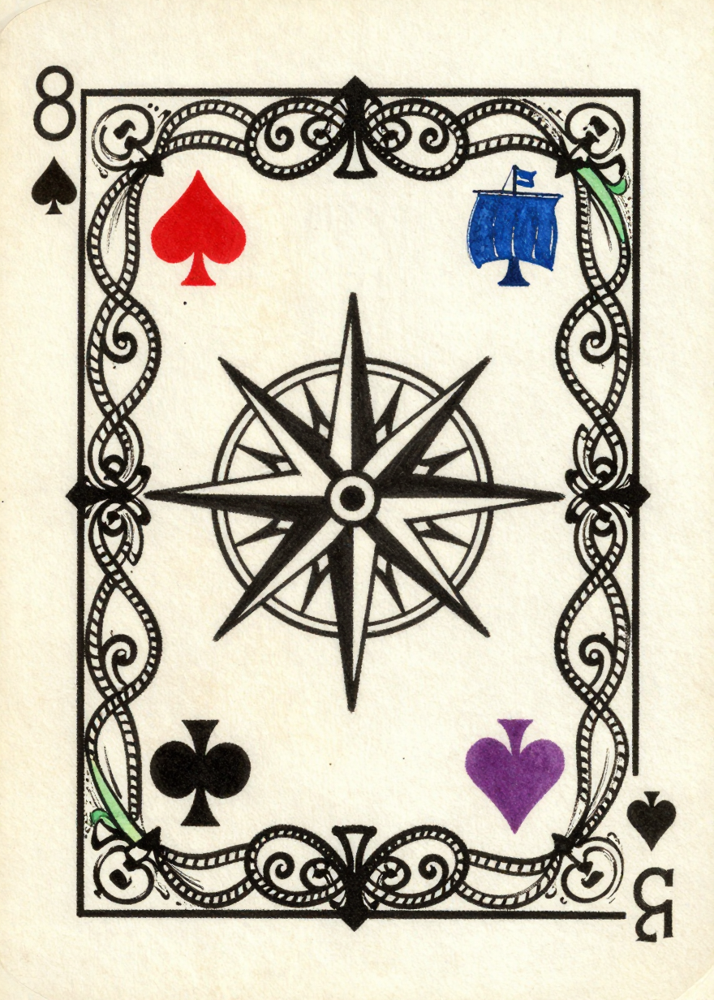

### C5. back_treasures (1343) ❌
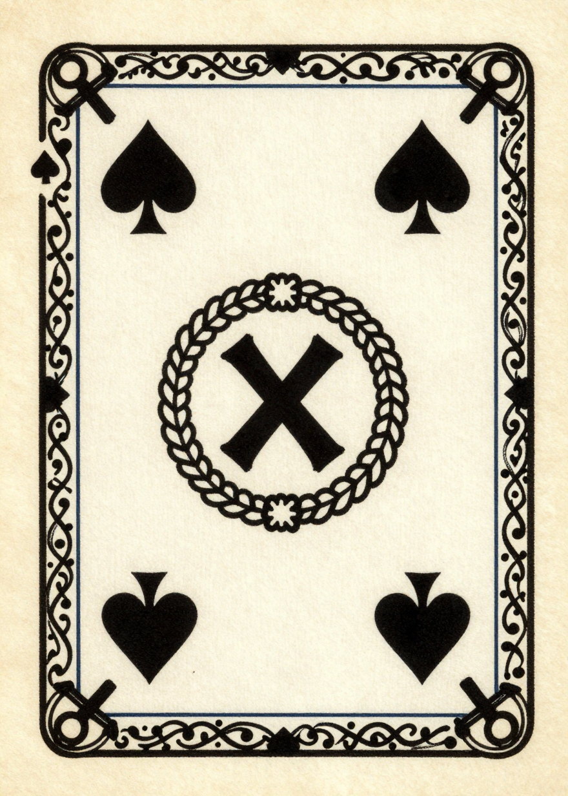
