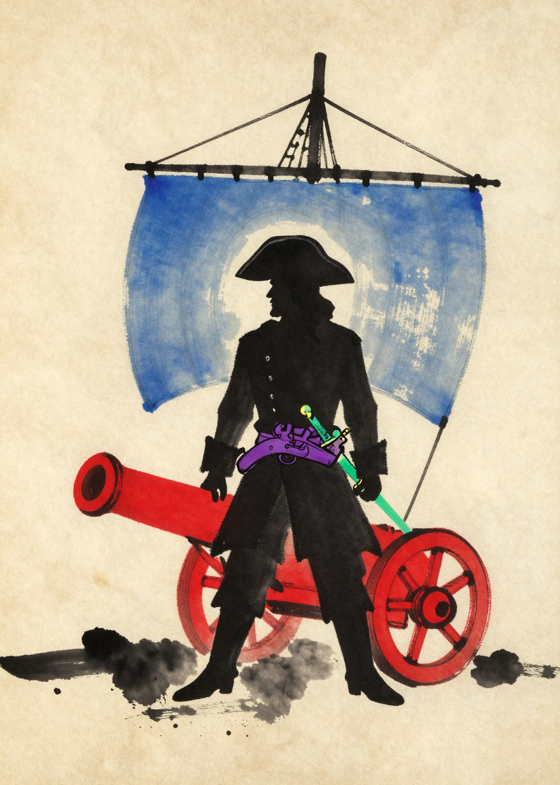
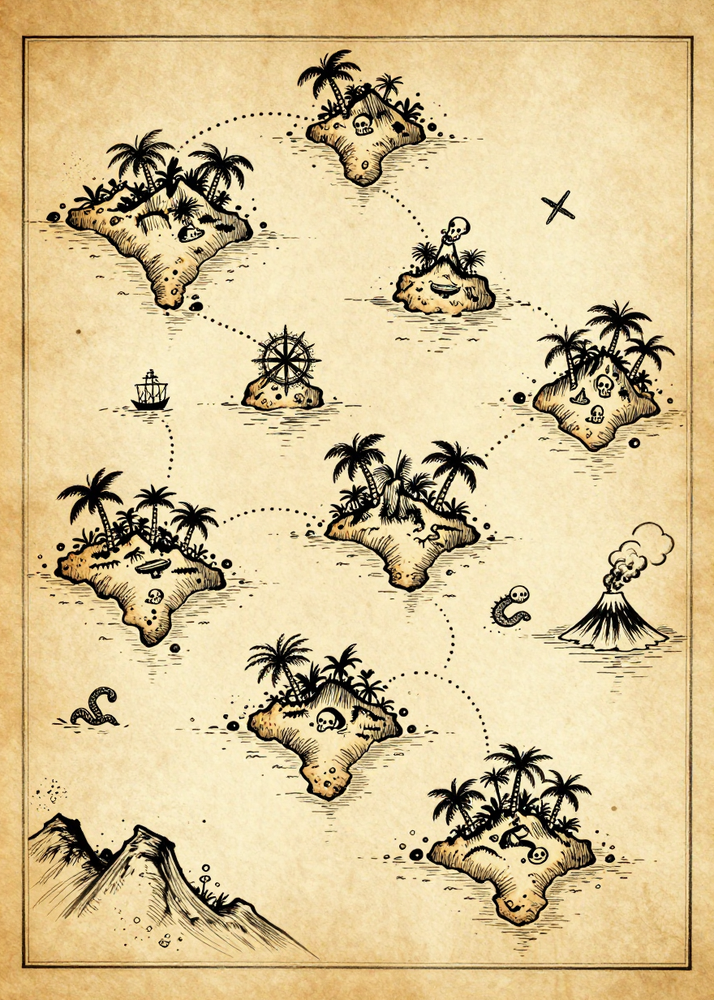
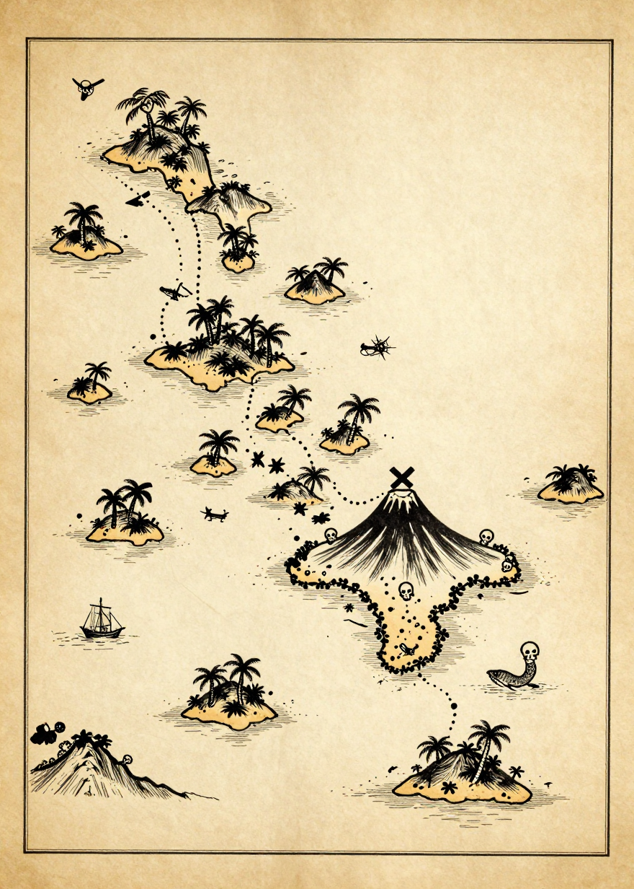
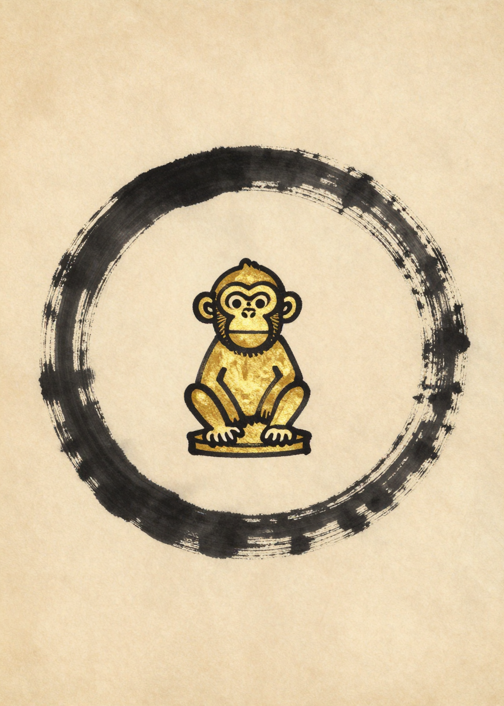
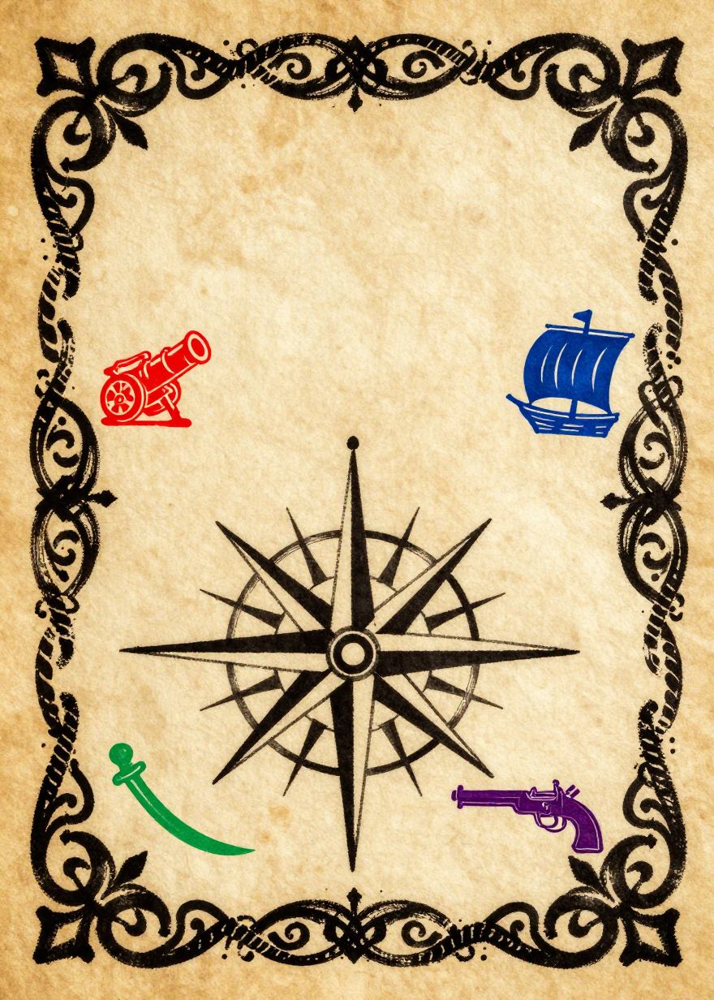
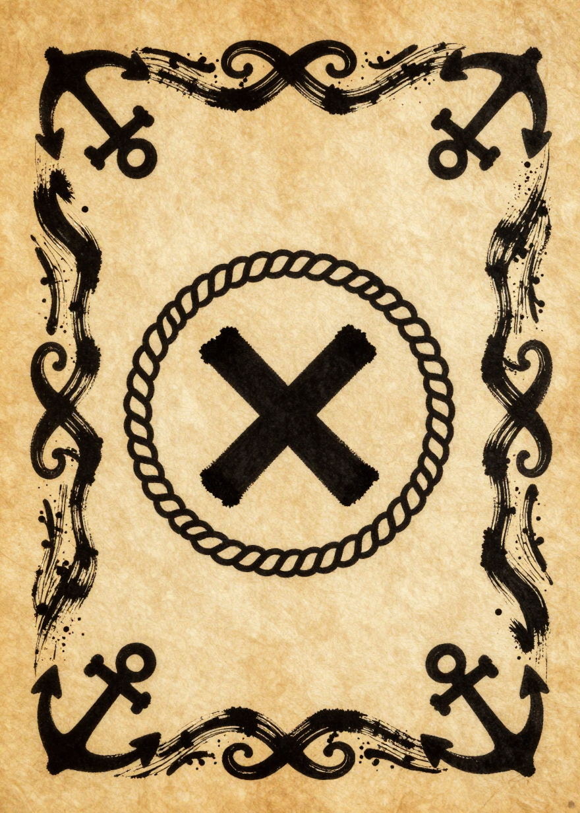

# ART-14 — final rework sweep (6 images) — 6/6 pre-screened keep

Batch of 2026-07-16, single dispatch (kernel v23), Z-Image-Turbo, seeds
1347–1352 per `img14/generation_log.csv`. Doctrine: style bible **v1.3.2**
+ Jules's ART-13 gate notes. Verdicts are Claude's pre-screen — the gate
ruling is Jules's.
Prior galleries: [ART-13](REVIEW-ART13.md) · [ART-12](REVIEW-ART12.md) · [ART-11](REVIEW-ART11.md).

| # | Card | Verdict |
|---|------|---------|
| 1 | recruitment_captain (1347) | ✅ keep — the cannon is finally fully vermillion (barrel, carriage, wheels), indigo sail on a bare mast behind, plum pistol at the belt, jade saber in hand; solid black silhouette with gravitas |
| 2 | map_treasure_01 (1348) | ✅ keep — dense island chain with skulls, palms, compass wheel, monsters, ship and route; water filled with wave marks, nothing empty (thin border → in-game crop per ruling) |
| 3 | map_treasure_02 (1349) | ✅ keep — sprawling archipelago, big X-topped volcano island ringed with skulls, monster + ship + route; the fuller of the two candidates (thin border → in-game crop) |
| 4 | talisman_golden_monkey (1350) | ✅ keep — now a hand-drawn idol: bold black outlines, flat gold wash, clearly a drawing on parchment, complete ensō |
| 5 | back_events (1351) | ✅ keep — parchment panel with brushed scrollwork border, black compass rose center, and the four correct suit emblems (vermillion cannon, indigo sail, jade saber, plum pistol); zero playing-card contamination |
| 6 | back_treasures (1352) | ✅ keep — monochrome parchment panel, anchors in the corners, X in a rope wreath at center; reads unmistakably as the treasures back |

**Standing after this sweep: all 33 cards have a clean candidate.**
Pending Jules's gate: these 6 masters + the map pick (01 vs 02 — only one
is kept; 02 is Claude's recommendation for density and the X placement).

---

### 1. recruitment_captain (1347) ✅

### 2. map_treasure_01 (1348) ✅

### 3. map_treasure_02 (1349) ✅

### 4. talisman_golden_monkey (1350) ✅

### 5. back_events (1351) ✅

### 6. back_treasures (1352) ✅

