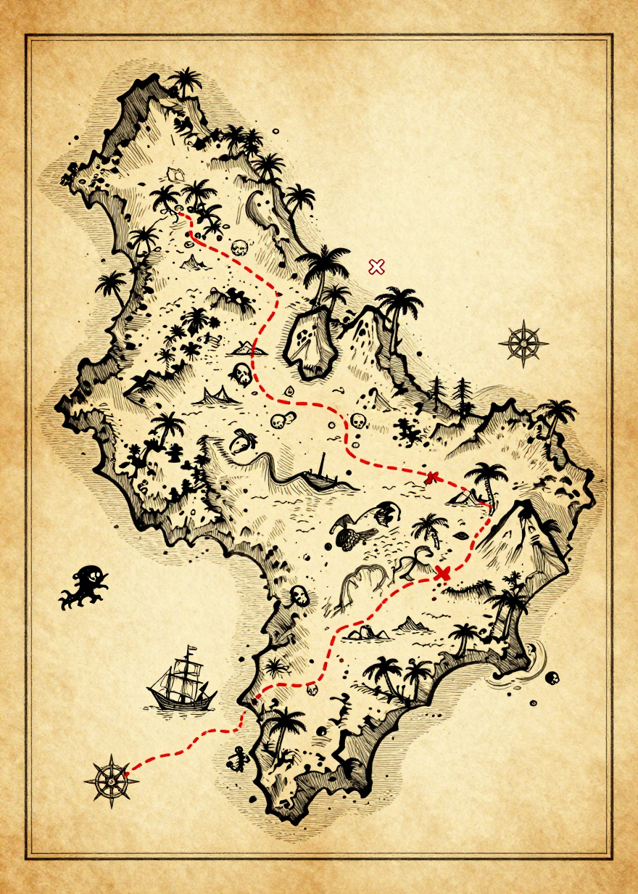
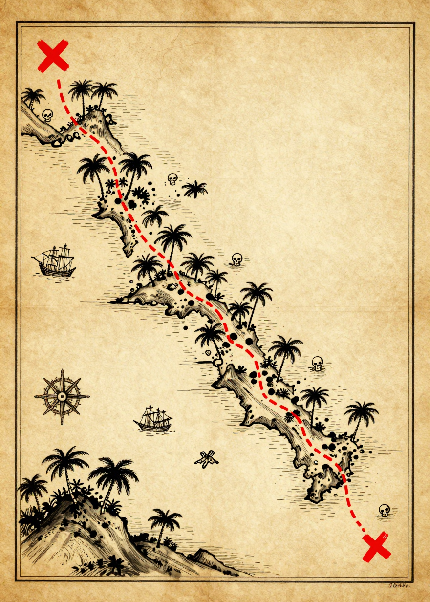
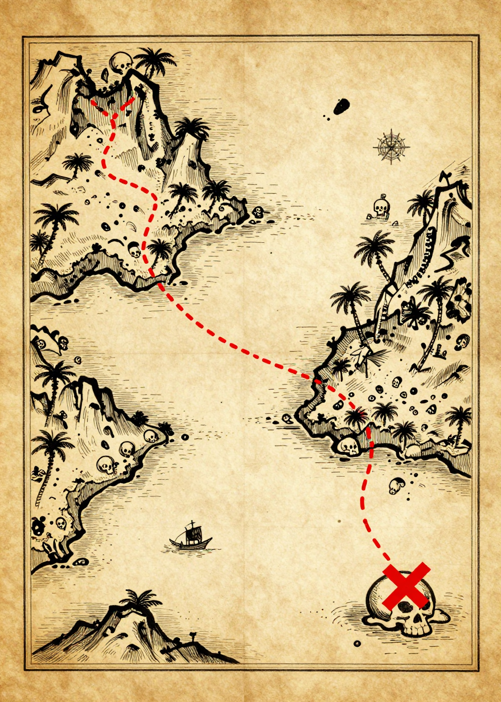
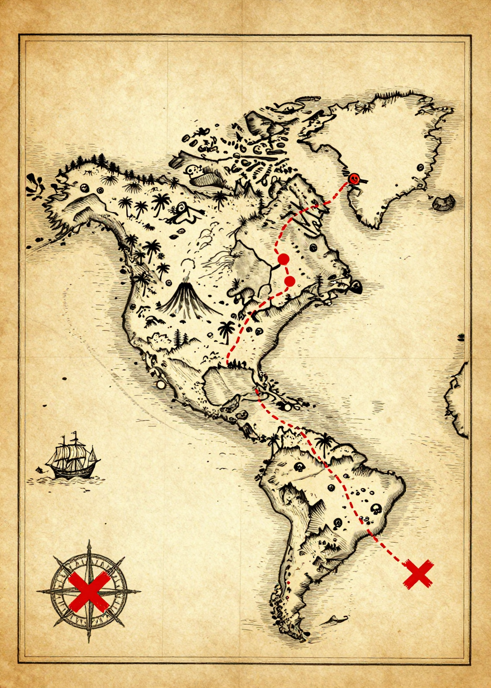
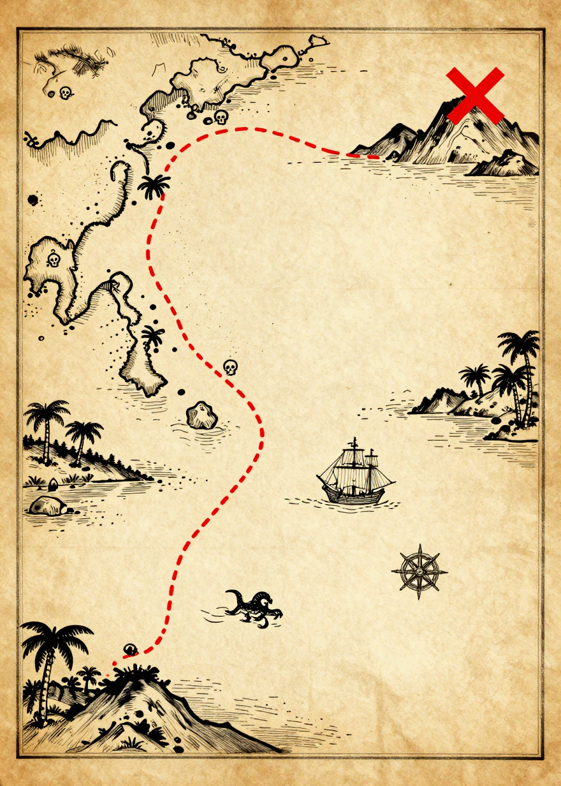
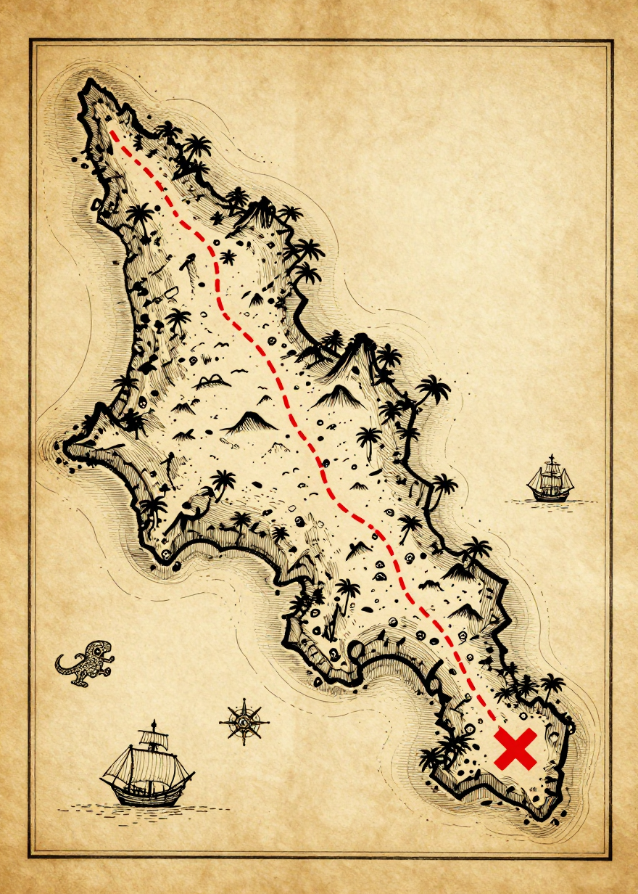
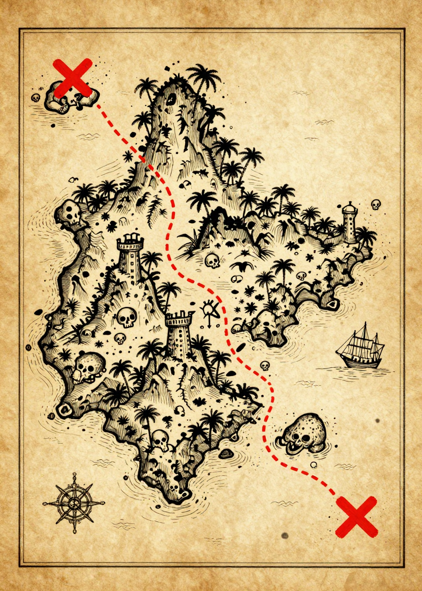

# ART-15 — treasure map candidates (7) — Jules picks ONE

Batch of 2026-07-16, Z-Image-Turbo, seeds 1353–1359 per
`img15/generation_log.csv`. Spec (style bible v1.3.3, from Jules's
vintage references): dense ~60% land, wave marks everywhere else, red
dashed route as the only color touching at least two corners, exactly ONE
red treasure X in exactly one corner. Model-drawn borders are cropped
in-game. **The choice is Jules's — nothing is installed yet.**

| # | Seed | Pre-screen |
|---|------|-----------|
| 1 | 1353 | ⚠️ spec-miss — the densest, most reference-like linework of the set, but the treasure X is tiny and faint with two extra small x marks along the route |
| 2 | 1354 | ❌ two giant X's (top-left AND bottom-right) — two treasures |
| 3 | 1355 | ✅ **recommended** — route enters the top-left corner, crosses the strait between two skull-strewn landmasses, ends at ONE big red X on a skull-shaped island in the bottom-right corner; dense, ship + compass + watch-side details |
| 4 | 1356 | ❌ drew the actual Americas, plus a second X on the compass rose |
| 5 | 1357 | ❌ single X and corner-to-corner route, but ~70% empty ocean — fails the density ruling |
| 6 | 1358 | ⚠️ runner-up — one clean prominent X bottom-right, handsome single island, but the route only clearly reaches one canvas corner and density is middling |
| 7 | 1359 | ❌ gloriously dense (ruined watchtowers, skulls everywhere) but two X's again |

### 1. map_treasure_01 (1353) ⚠️

### 2. map_treasure_02 (1354) ❌

### 3. map_treasure_03 (1355) ✅ recommended

### 4. map_treasure_04 (1356) ❌

### 5. map_treasure_05 (1357) ❌

### 6. map_treasure_06 (1358) ⚠️

### 7. map_treasure_07 (1359) ❌

