# ART-16 — boarding redo (10) + map layout-5 rework (3)

Batch of 2026-07-16, Z-Image-Turbo, seeds 1360–1372 per
`img16/generation_log.csv`. Doctrine: style bible v1.3.4 (shared two-ship
rope-boarding scene + per-profile value-color bursts; map = layout #5 with
more land, fewer skulls). Verdicts are Claude's pre-screen — the gate
ruling is Jules's.
Prior galleries: [ART-15](REVIEW-ART15.md) · [ART-14](REVIEW-ART14.md).

**Honest summary:** the boarding fleet renders beautifully and the burst
COLORS are right on 9 of 10, but the bursts are consistently much smaller
than "little explosions" — tiny dots — and only ~half the images clearly
show TWO ships. If the dots are too subtle in play, one more roll with
"large bursts" phrasing is cheap. The three maps all keep layout #5's
single X and three-corner route with far fewer skulls; none quite reaches
60% land — #10 is the fullest.

| # | Card | Verdict |
|---|------|---------|
| B1 | boarding_canons_sailors (1360) | ✅ closest to spec — two ships, rope-swinging silhouettes, red + plum bursts (small) |
| B2 | boarding_canons_officers (1361) | ⚠️ one ship reads, red + jade correct, stray gold rope ornament on the bow |
| B3 | boarding_sails_sailors (1362) | ⚠️ one ship; indigo + plum bursts correct, deck melee lively |
| B4 | boarding_officers_sailors (1363) | ✅ two ships, swinger on the rope, jade + plum correct |
| B5 | boarding_officers_sails (1364) | ⚠️ one ship; jade + indigo present plus a stray teal |
| B6 | boarding_canons_sails (1365) | ⚠️ two ships but NO crew silhouettes at all; red + blue correct |
| B7 | boarding_canons_sails_sailors (1366) | ⚠️ one ship, two swimmers in the water, red barely visible (blue + plum fine) |
| B8 | boarding_canons_officers_sailors (1367) | ⚠️ one ship; all three burst colors correct (red, jade, plum) |
| B9 | boarding_canons_officers_sails (1368) | ⚠️ two ships and a swinger, but the JADE burst is missing (red + blue only) |
| B10 | boarding_officers_sails_sailors (1369) | ✅ two ships, crews, all three colors present (jade, indigo, plum); faint corner seal artifact |
| M8 | map_treasure_08 (1370) | ⚠️ single X, three-corner route, one skull — but land ~40%, big empty center |
| M9 | map_treasure_09 (1371) | ⚠️ same layout, three small skulls, land ~45% |
| M10 | map_treasure_10 (1372) | ✅ **recommended** — fullest coast wrapping three corners, single X on the mountain, two skull markers, ship + compass in the water |

---

## Boardings — shared two-ship scene, per-profile color bursts

### B1. boarding_canons_sailors (1360) ✅
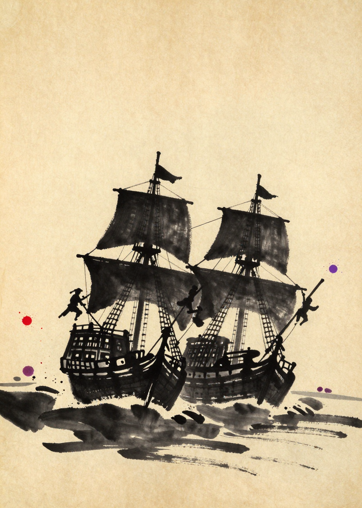

### B2. boarding_canons_officers (1361) ⚠️
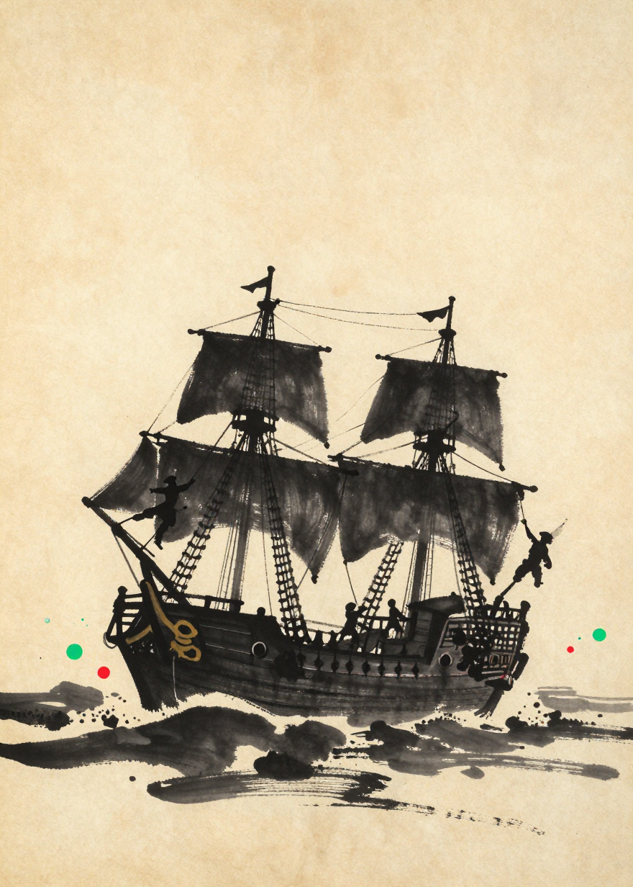

### B3. boarding_sails_sailors (1362) ⚠️
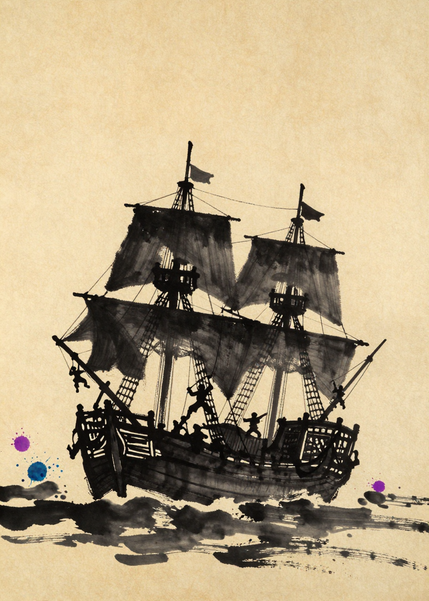

### B4. boarding_officers_sailors (1363) ✅
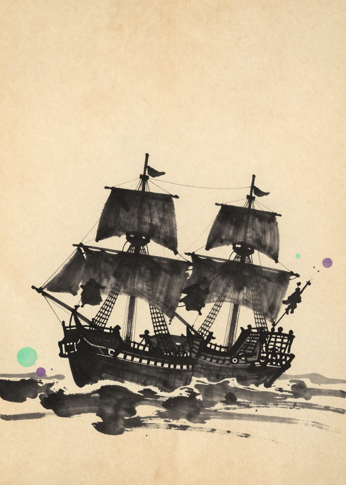

### B5. boarding_officers_sails (1364) ⚠️
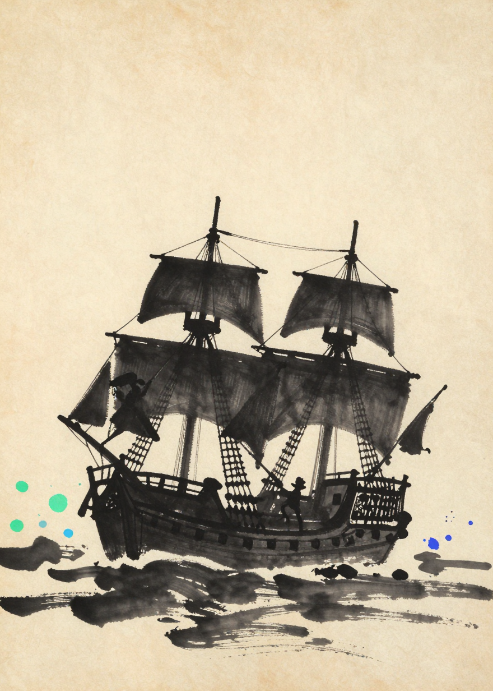

### B6. boarding_canons_sails (1365) ⚠️
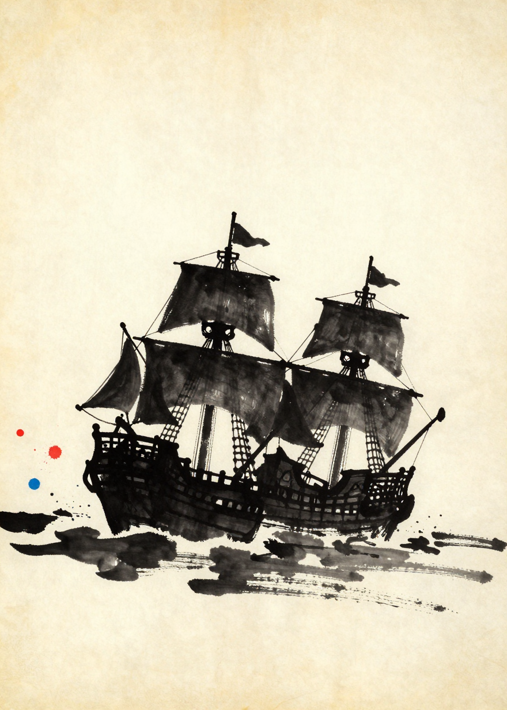

### B7. boarding_canons_sails_sailors (1366) ⚠️
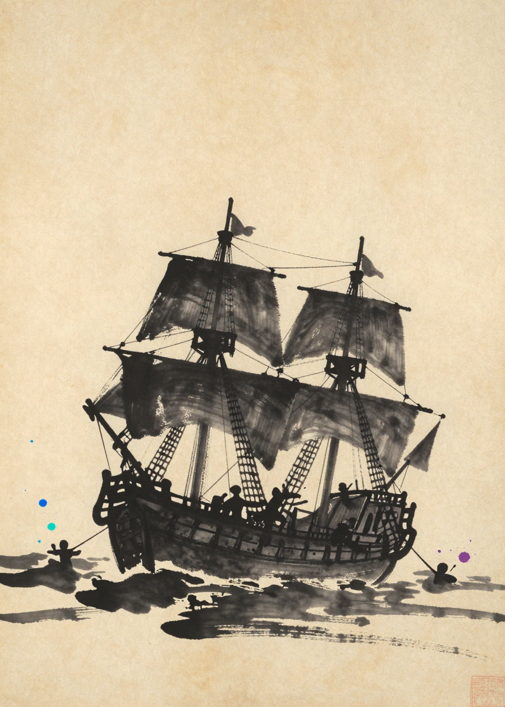

### B8. boarding_canons_officers_sailors (1367) ⚠️
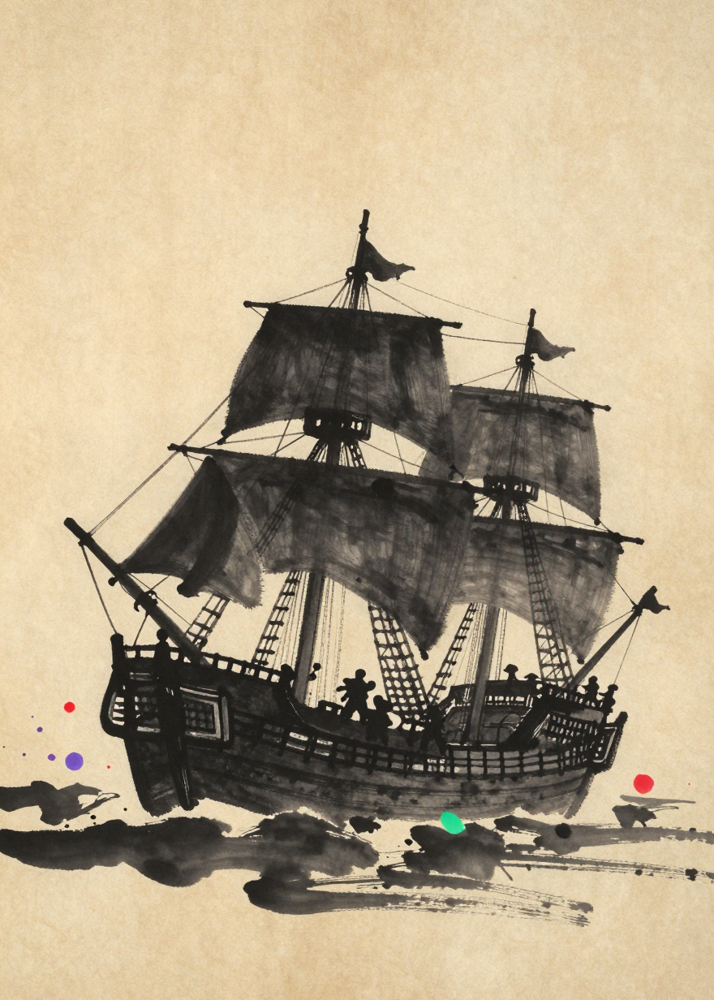

### B9. boarding_canons_officers_sails (1368) ⚠️
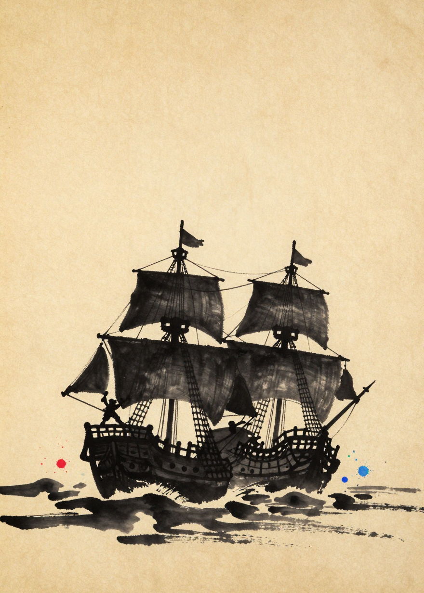

### B10. boarding_officers_sails_sailors (1369) ✅
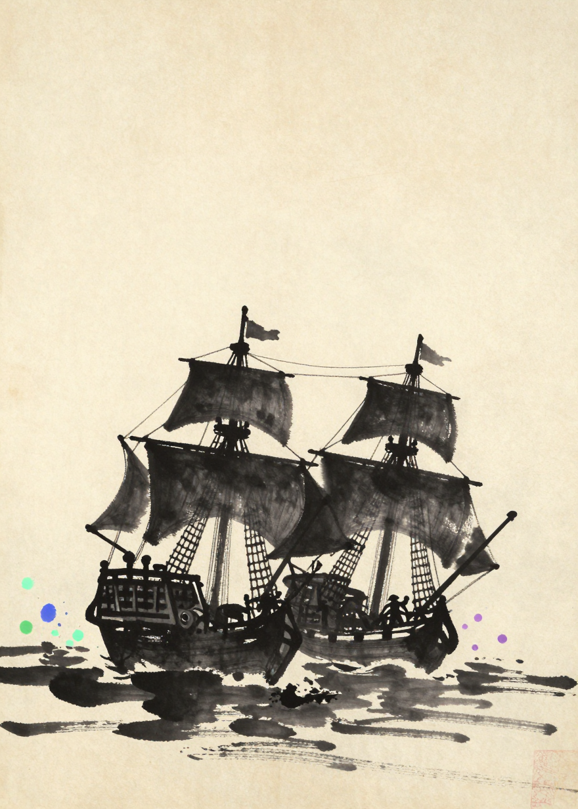

## Treasure map — layout #5 rework

### M8. map_treasure_08 (1370) ⚠️
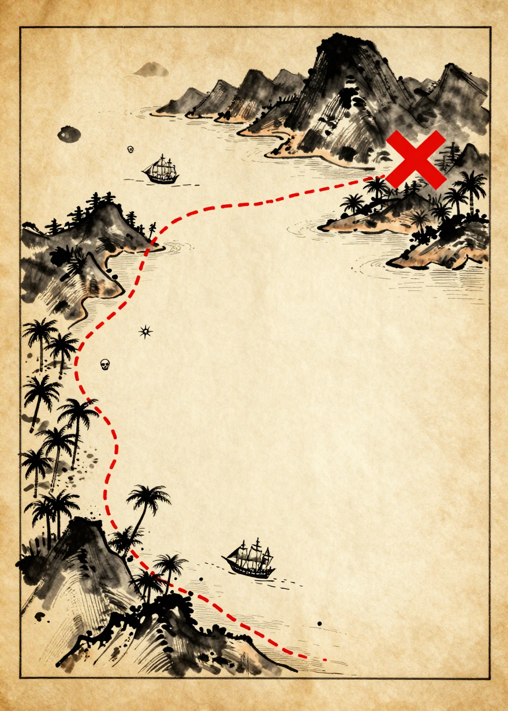

### M9. map_treasure_09 (1371) ⚠️
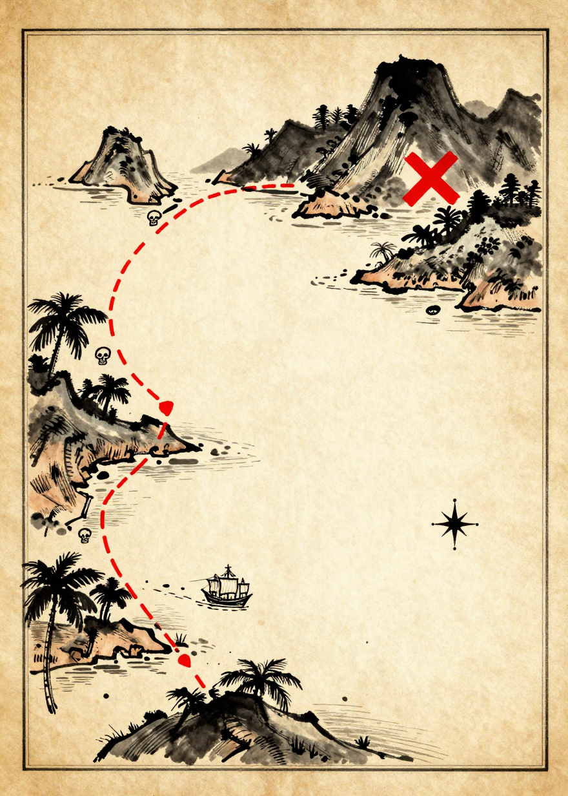

### M10. map_treasure_10 (1372) ✅ recommended
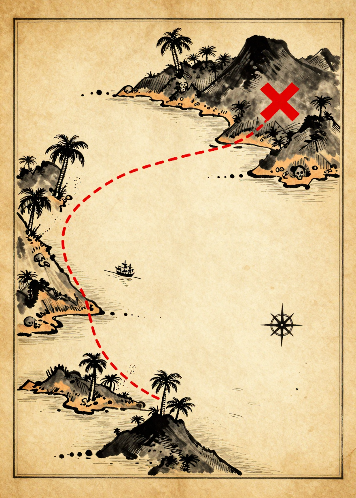
