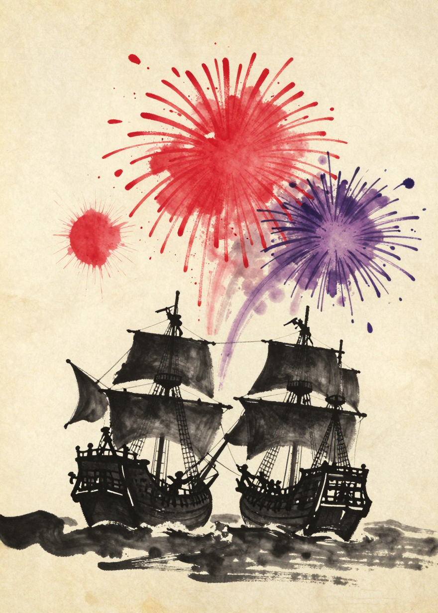
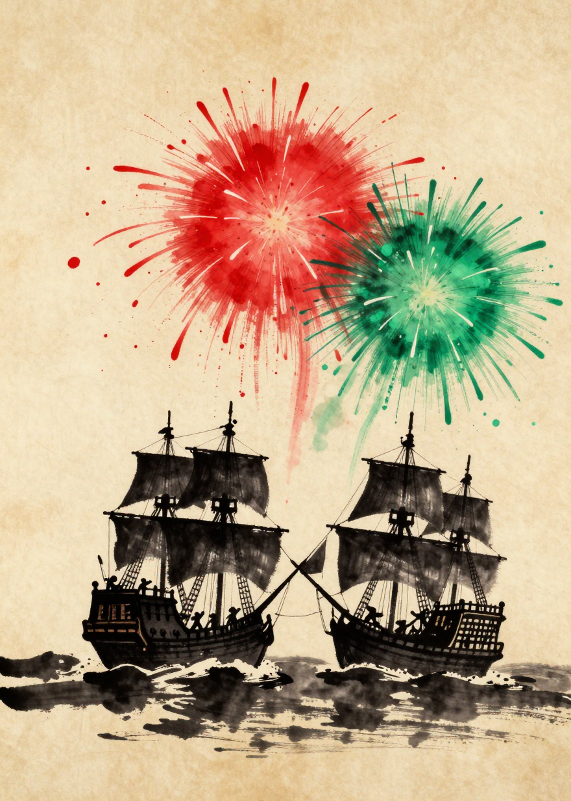
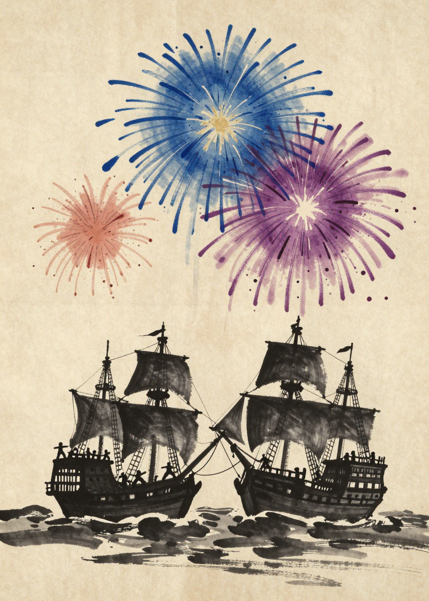
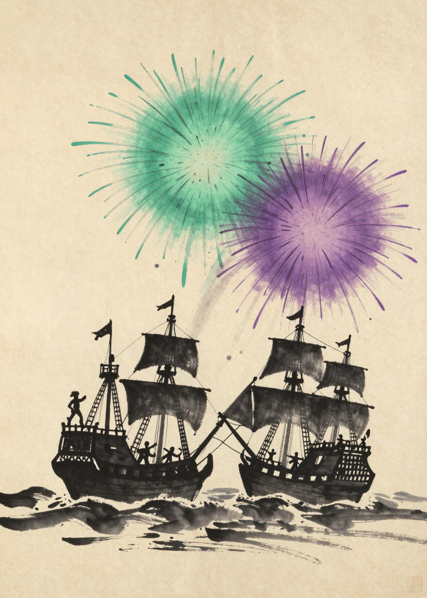
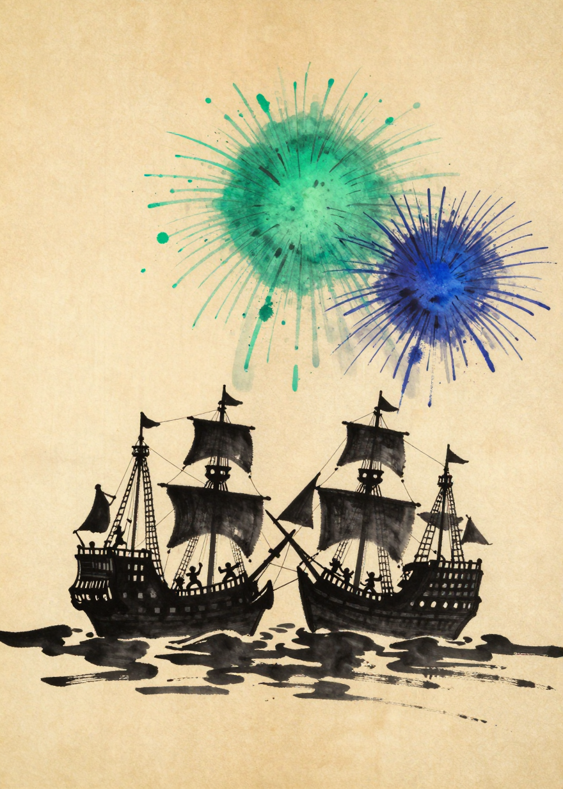
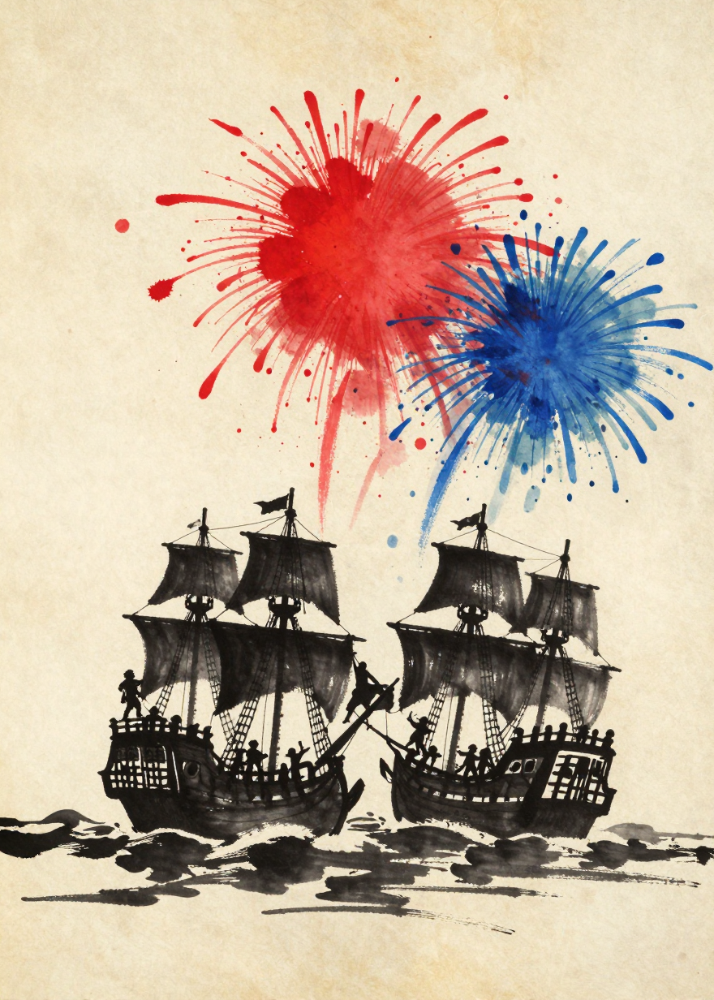
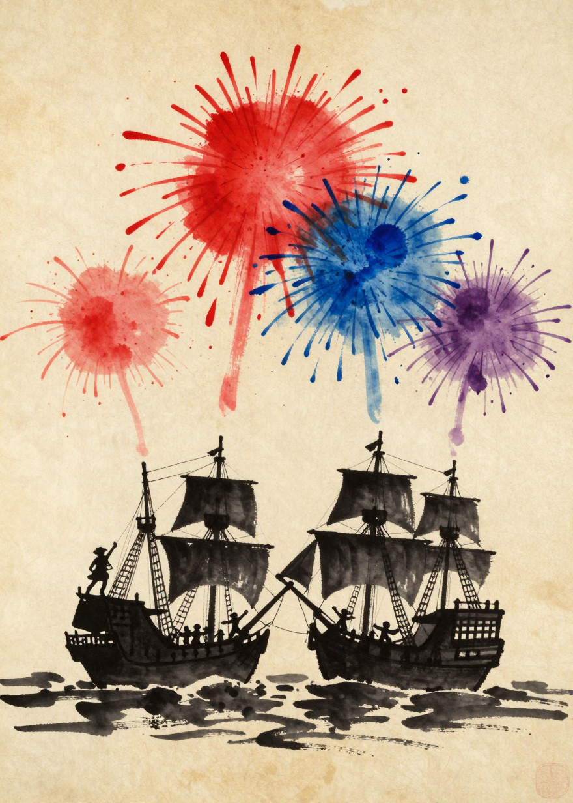
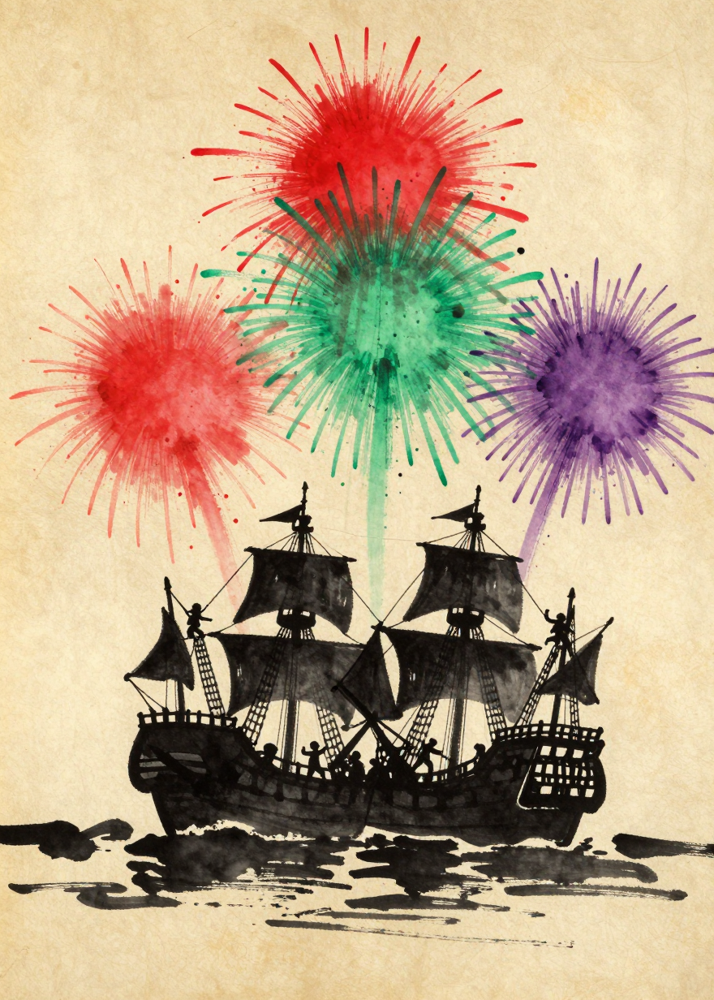
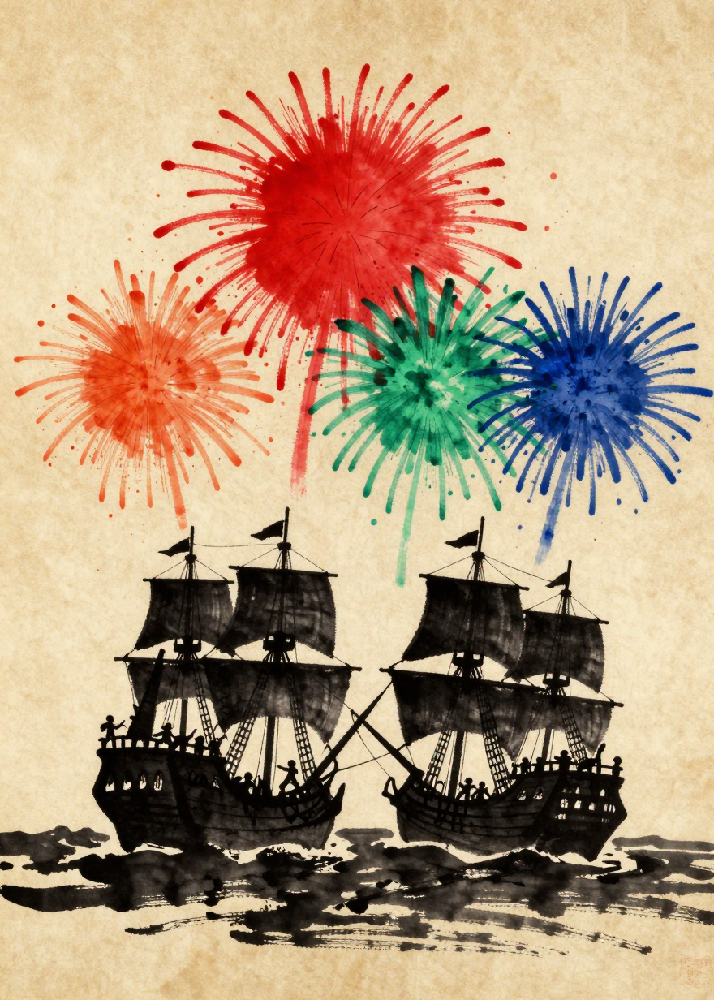
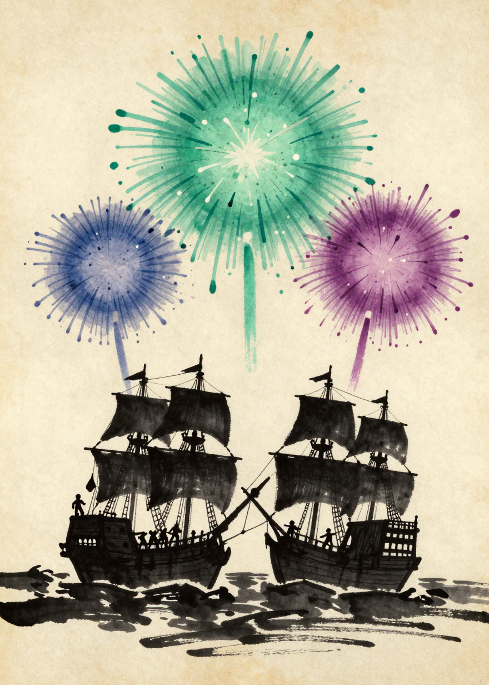

# ART-17 — boarding firework re-roll (10) — 9 keep / 1 flag

Batch of 2026-07-16, Z-Image-Turbo, seeds 1373–1382 per
`img17/generation_log.csv`. Doctrine: style bible v1.3.5 — two ships
locked in battle, rope silhouettes, huge value-color ink bursts exploding
like fireworks above the boats, instantly visible. Verdicts are Claude's
pre-screen — the gate ruling is Jules's.
Prior galleries: [ART-16](REVIEW-ART16.md) · [ART-15](REVIEW-ART15.md).

**The firework phrasing fixed everything at once:** all 10 show two ships
with crews, and the bursts are huge and instantly readable. Some images
carry a second echo burst of the same red family (noted); the only real
flag is B3, whose extra burst is a distinctly off-profile red.

| # | Card | Verdict |
|---|------|---------|
| B1 | boarding_canons_sailors (1373) | ✅ keep — two ships, crews, giant vermillion + plum fireworks (plus a smaller red echo) |
| B2 | boarding_canons_officers (1374) | ✅ keep — two ships bows crossed, red + green fireworks, clean |
| B3 | boarding_sails_sailors (1375) | ⚠️ flag — indigo + plum correct and huge, but a third salmon-RED burst sneaks in (red = canons, could mislead) |
| B4 | boarding_officers_sailors (1376) | ✅ keep — jade + plum pair, crews and a mast-top figure, immaculate |
| B5 | boarding_officers_sails (1377) | ✅ keep — jade + indigo pair, crews on both decks |
| B6 | boarding_canons_sails (1378) | ✅ keep — red + blue, rope-swinger center, crews everywhere (the ART-16 empty-decks miss is fixed) |
| B7 | boarding_canons_sails_sailors (1379) | ✅ keep — red + indigo + plum all present (light-red echo; faint corner seal artifact) |
| B8 | boarding_canons_officers_sailors (1380) | ✅ keep — red + jade + plum, two rope climbers, second red echo |
| B9 | boarding_canons_officers_sails (1381) | ✅ keep — red + jade + indigo all clearly present (the ART-16 missing-jade miss is fixed; orange-red echo) |
| B10 | boarding_officers_sails_sailors (1382) | ✅ keep — jade + indigo + plum exactly, the cleanest of the set |

---

### B1. boarding_canons_sailors (1373) ✅

### B2. boarding_canons_officers (1374) ✅

### B3. boarding_sails_sailors (1375) ⚠️

### B4. boarding_officers_sailors (1376) ✅

### B5. boarding_officers_sails (1377) ✅

### B6. boarding_canons_sails (1378) ✅

### B7. boarding_canons_sails_sailors (1379) ✅

### B8. boarding_canons_officers_sailors (1380) ✅

### B9. boarding_canons_officers_sails (1381) ✅

### B10. boarding_officers_sails_sailors (1382) ✅

